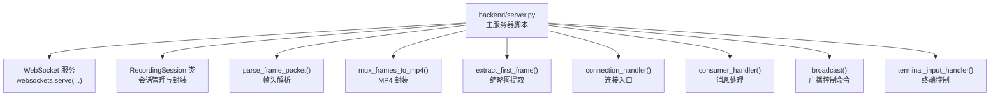
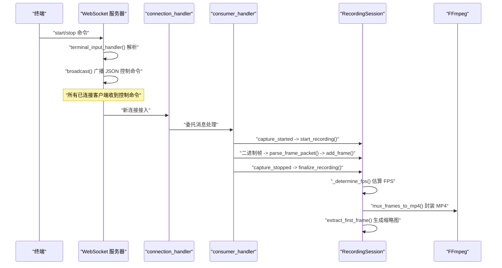
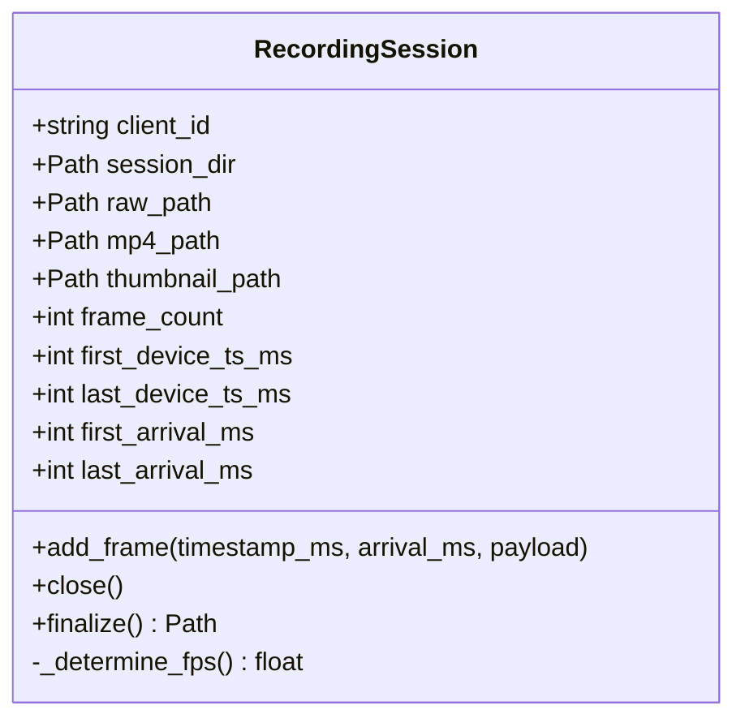
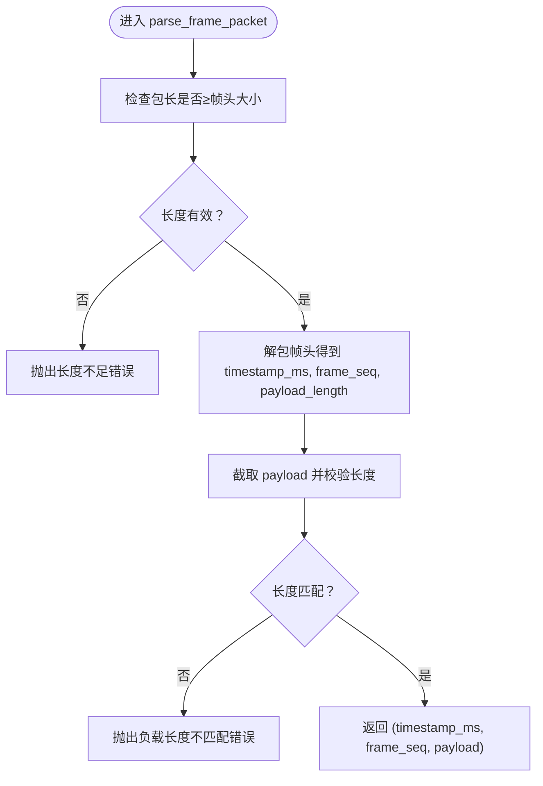
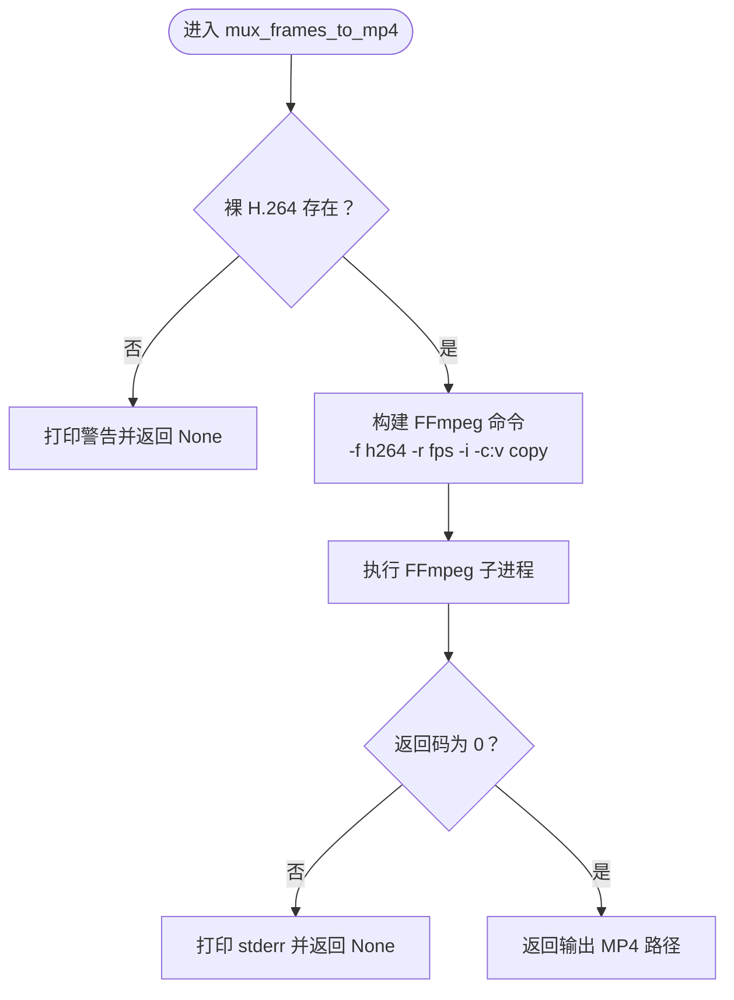
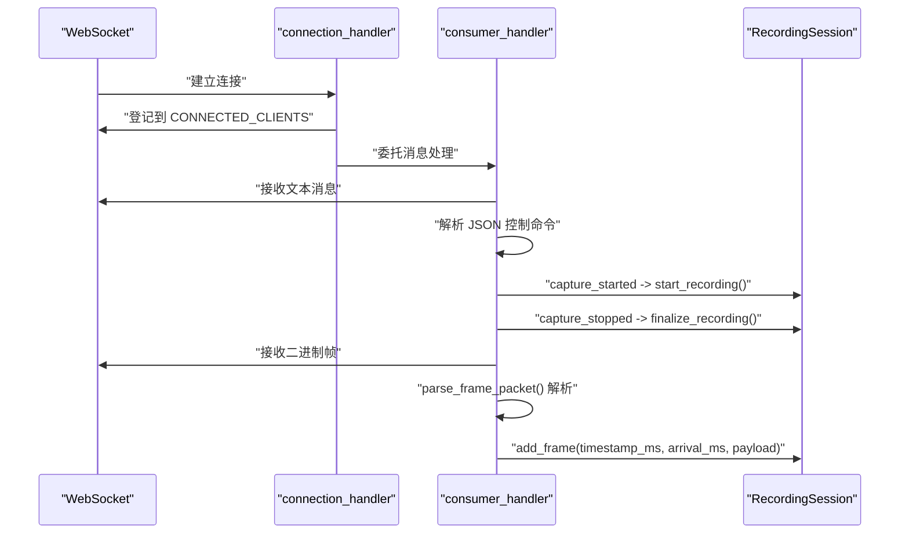
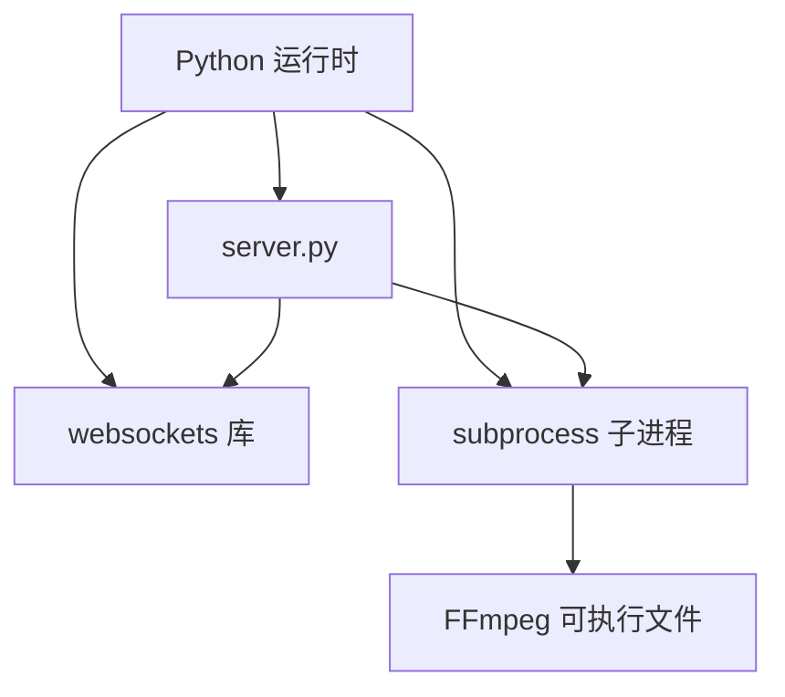

# 后端服务器

<cite>
**本文引用的文件**
- [server.py](file://backend/server.py)
- [README.md](file://backend/README.md)
- [requirements.txt](file://backend/requirements.txt)
</cite>

## 目录
1. [简介](#简介)
2. [项目结构](#项目结构)
3. [核心组件](#核心组件)
4. [架构总览](#架构总览)
5. [详细组件分析](#详细组件分析)
6. [依赖关系分析](#依赖关系分析)
7. [性能考量](#性能考量)
8. [故障排查指南](#故障排查指南)
9. [结论](#结论)
10. [附录](#附录)

## 简介
本文件为 lab-log 项目的后端服务器架构文档，聚焦于基于 Python 的 asyncio 与 websockets 库构建的事件驱动架构。服务器通过 WebSocket 接收来自 Android 相机 App 的 H.264 视频帧，按会话写入磁盘并在录制结束时调用 FFmpeg 将裸 H.264 封装为 MP4。核心组件 RecordingSession 负责管理单个客户端的录制会话，包括创建独立目录、写入原始 H.264 流、记录时间戳以估算 FPS，并在会话结束时进行 MP4 封装与缩略图提取。WebSocket 服务器通过 connection_handler 管理客户端连接生命周期，通过 consumer_handler 处理文本（控制命令）与二进制（视频帧）消息。broadcast 机制将来自终端的控制命令广播给所有已连接客户端。服务器端 FPS 估算优先使用服务器到达时间，其次使用设备时间戳，若均不可用则采用保底值。

## 项目结构
- backend/server.py：主服务器脚本，包含 WebSocket 服务、会话管理、帧解析、封装与缩略图提取、终端控制与广播逻辑。
- backend/README.md：项目说明与各模块使用说明。
- backend/requirements.txt：Python 依赖（仅 websockets）。

图表来源
- [server.py](file://backend/server.py#L233-L439)

章节来源
- [server.py](file://backend/server.py#L1-L120)
- [README.md](file://backend/README.md#L1-L60)

## 核心组件
- RecordingSession：面向单个客户端的录制会话，负责：
  - 会话目录与文件命名（recordings/<client>_<timestamp>/）
  - 追加写入 H.264 原始流
  - 记录首尾帧设备时间戳与服务器到达时间
  - 会话结束时估算 FPS、调用 FFmpeg 封装为 MP4、提取缩略图
- parse_frame_packet：解析自定义帧头（设备时间戳、帧序号、负载长度），并返回有效负载
- mux_frames_to_mp4：调用 FFmpeg 将裸 H.264 封装为 MP4，显式指定帧率，避免时间轴错误
- extract_first_frame：从 H.264 中提取第一帧作为缩略图
- connection_handler：新连接入口，登记客户端并委托 consumer_handler
- consumer_handler：消息分发器，处理文本控制命令与二进制视频帧
- broadcast：将控制命令广播给所有已连接客户端
- terminal_input_handler：从终端读取 start/stop 命令并广播

章节来源
- [server.py](file://backend/server.py#L26-L133)
- [server.py](file://backend/server.py#L135-L208)
- [server.py](file://backend/server.py#L210-L232)
- [server.py](file://backend/server.py#L233-L303)
- [server.py](file://backend/server.py#L305-L324)
- [server.py](file://backend/server.py#L326-L423)
- [README.md](file://backend/README.md#L60-L170)

## 架构总览
服务器采用事件驱动模型，基于 asyncio 与 websockets：
- 事件循环：主线程启动 asyncio 事件循环，注册 WebSocket 服务与终端输入协程
- 连接生命周期：connection_handler 负责接入与清理；consumer_handler 负责消息处理与会话管理
- 控制通道：终端输入通过 terminal_input_handler 生成 JSON 控制命令，经 broadcast 广播至所有客户端
- 数据通道：二进制帧经 parse_frame_packet 解析后写入 RecordingSession，最终由 FFmpeg 封装

图表来源
- [server.py](file://backend/server.py#L233-L324)
- [server.py](file://backend/server.py#L326-L439)

## 详细组件分析

### RecordingSession 类
- 职责
  - 会话目录与文件：recordings/<client>_<timestamp>/，包含 stream.h264、stream.mp4、thumbnail.jpg
  - 写入原始 H.264：add_frame() 追加写入并维护帧计数与时间戳范围
  - 会话终结：finalize() 关闭文件、估算 FPS、调用 FFmpeg 封装、提取缩略图
- FPS 估算策略
  - 优先使用服务器到达时间估算（更贴近实际接收节奏）
  - 若服务器到达时间估算不可信（过低或异常），回退到设备时间戳
  - 两者均不可用时使用保底值 10 FPS
- 封装与缩略图
  - 使用 FFmpeg 对裸 H.264 进行封装，显式指定帧率，避免时间轴错误
  - 提取第一帧为 JPEG 缩略图，便于快速预览

图表来源
- [server.py](file://backend/server.py#L26-L133)

章节来源
- [server.py](file://backend/server.py#L26-L133)
- [README.md](file://backend/README.md#L60-L125)

### 帧头解析 parse_frame_packet
- 帧头格式（大端）：设备时间戳（uint64 毫秒）、帧序号（uint32）、负载长度（uint32）
- 解析流程
  - 校验包长包含完整帧头
  - 解包得到 timestamp_ms、frame_seq、payload_length
  - 截取负载并校验长度一致性
  - 返回 timestamp_ms、frame_seq、payload

图表来源
- [server.py](file://backend/server.py#L135-L148)

章节来源
- [server.py](file://backend/server.py#L135-L148)
- [README.md](file://backend/README.md#L36-L60)

### MP4 封装 mux_frames_to_mp4
- 输入：裸 H.264 文件路径、输出 MP4 路径、估算帧率
- 封装策略
  - 使用 FFmpeg，输入格式为 h264，显式帧率 -r <fps>
  - 视频轨道直接拷贝 -c:v copy，避免重编码，速度快且无损
  - 若 FFmpeg 返回非零退出码，记录 stderr 并返回 None
- 环境变量
  - 可通过环境变量 FFMPEG_BIN 指定 FFmpeg 可执行文件路径

图表来源
- [server.py](file://backend/server.py#L150-L179)
- [README.md](file://backend/README.md#L90-L140)

章节来源
- [server.py](file://backend/server.py#L150-L179)
- [README.md](file://backend/README.md#L90-L140)

### 缩略图提取 extract_first_frame
- 功能：从 H.264 中提取第一帧并保存为 JPEG
- 参数：输入 H.264 路径、输出 JPEG 路径
- 行为：若输入文件不存在，打印警告并返回 None；否则调用 FFmpeg 提取第一帧并返回输出路径

章节来源
- [server.py](file://backend/server.py#L181-L208)
- [README.md](file://backend/README.md#L140-L170)

### WebSocket 服务器：connection_handler 与 consumer_handler
- connection_handler
  - 新连接登记到全局集合 CONNECTED_CLIENTS
  - 记录客户端标识与请求路径，委托 consumer_handler 处理消息
  - 异常与断开时移除连接并确保会话结束
- consumer_handler
  - 文本消息：解析 JSON 控制命令，识别 capture_started/capture_stopped 并触发会话开始/结束
  - 二进制消息：解析帧头，记录服务器到达时间，写入会话
  - 异常捕获：ConnectionClosed 时确保 finalize_recording()

图表来源
- [server.py](file://backend/server.py#L233-L303)

章节来源
- [server.py](file://backend/server.py#L233-L303)
- [README.md](file://backend/README.md#L115-L170)

### 广播机制 broadcast
- 功能：将控制命令广播给所有已连接客户端
- 实现要点
  - 使用 asyncio.gather 并开启 return_exceptions=True，确保即使部分客户端断开也能继续广播
  - 对发送异常进行记录，便于诊断
- 适用场景：从终端向所有 Android App 下发 start/stop_capture 指令

章节来源
- [server.py](file://backend/server.py#L305-L324)
- [README.md](file://backend/README.md#L160-L215)

### 终端控制 terminal_input_handler
- 功能：从服务器终端读取命令，构造 JSON 控制消息并广播
- 支持命令
  - start [w]:[h] [bitrate_mb] [fps]：可选宽高比、码率（MB）、目标 FPS
  - stop：停止录制并广播 stop_capture
- 参数校验与默认值
  - 宽高比：正整数，缺省时不下发 aspectRatio 字段
  - 码率：正整数（MB），缺省 4MB
  - FPS：整数，缺省 10；负数修正为 10；0 表示不限帧率

章节来源
- [server.py](file://backend/server.py#L326-L423)
- [README.md](file://backend/README.md#L160-L215)

## 依赖关系分析
- 外部依赖
  - websockets：提供 WebSocket 服务端能力
  - FFmpeg：用于 H.264 封装与缩略图提取
- 内部模块
  - server.py：集中实现事件驱动的 WebSocket 服务、会话管理、帧解析、封装与广播
- 环境变量
  - FFMPEG_BIN：指定 FFmpeg 可执行文件路径

图表来源
- [requirements.txt](file://backend/requirements.txt#L1-L2)
- [server.py](file://backend/server.py#L1-L20)

章节来源
- [requirements.txt](file://backend/requirements.txt#L1-L2)
- [README.md](file://backend/README.md#L278-L291)

## 性能考量
- 无重编码封装：使用 -c:v copy 直接拷贝视频轨，避免 CPU 重编码开销，提升吞吐与稳定性
- 显式帧率：通过 -r <fps> 显式指定帧率，避免 FFmpeg 依赖不可靠的码流推断导致时间轴错误
- 服务器到达时间优先：优先使用服务器到达时间估算 FPS，更贴近实际接收节奏，减少时间轴漂移
- 并发广播：使用 asyncio.gather 并 return_exceptions=True，提高广播效率与健壮性
- I/O 优化：RecordingSession 将 H.264 原始流顺序写入，降低内存占用与延迟

[本节为通用性能建议，不直接分析具体文件]

## 故障排查指南
- FFmpeg 未安装或不可用
  - 现象：MP4 封装失败，stderr 输出
  - 处理：安装 FFmpeg 或设置环境变量 FFMPEG_BIN 指向可执行文件
- 帧头解析错误
  - 现象：提示包长不足或负载长度不匹配
  - 处理：检查 Android App 发送的帧头格式是否与约定一致
- 连接断开
  - 现象：consumer_handler 捕获 ConnectionClosed
  - 处理：确认网络稳定性；确保 App 正确上报 capture_stopped
- 广播失败
  - 现象：部分客户端发送异常被记录
  - 处理：检查客户端连接状态与网络；重试或重启服务

章节来源
- [server.py](file://backend/server.py#L150-L179)
- [server.py](file://backend/server.py#L181-L208)
- [server.py](file://backend/server.py#L233-L303)
- [server.py](file://backend/server.py#L305-L324)
- [README.md](file://backend/README.md#L278-L291)

## 结论
lab-log 后端服务器以事件驱动为核心，利用 asyncio 与 websockets 构建了稳定高效的视频录制服务。通过 RecordingSession 对会话进行全生命周期管理，结合自定义帧头解析与 FFmpeg 封装，实现了高质量、低延迟的录制与交付。广播机制与终端控制使多客户端同步录制成为可能。服务器端 FPS 估算策略兼顾准确性与鲁棒性，确保最终产物的时间轴与帧率符合预期。

[本节为总结性内容，不直接分析具体文件]

## 附录
- 部署拓扑
  - 单机部署：服务器监听 0.0.0.0:50001，Android App 通过 ws://<server_host>:50001/android-cam 连接
  - 可扩展性建议
    - 水平扩展：多实例部署 + 负载均衡，客户端连接随机分发
    - 会话隔离：每实例独立存储 recordings 目录，避免共享存储
    - 广播扩展：引入消息队列（如 Redis Pub/Sub）替代内存广播，支持跨实例广播
    - 资源监控：监控 CPU、内存、磁盘与网络 I/O，按需扩容
- 错误处理策略
  - 严格校验帧头与负载长度，异常即丢弃并记录
  - 广播使用 gather 并 return_exceptions=True，保证整体可用性
  - FFmpeg 失败时记录 stderr，避免中断后续流程
  - 终端输入参数进行边界检查与默认值处理，提升健壮性

[本节为概念性建议，不直接分析具体文件]