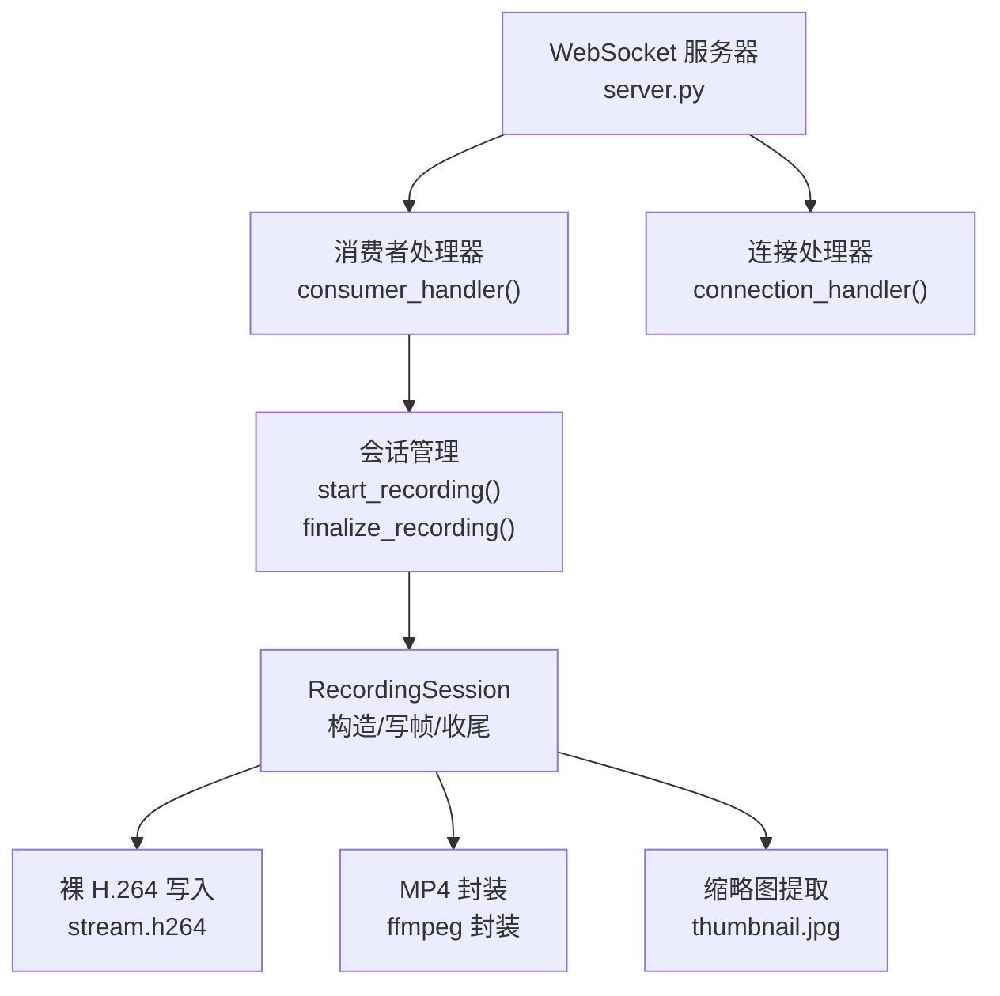
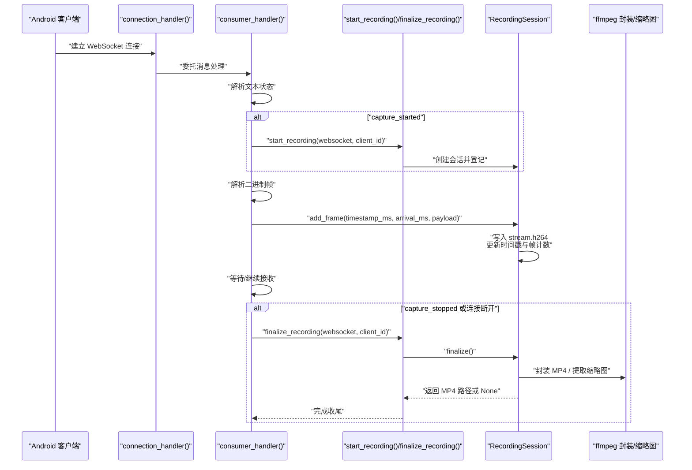
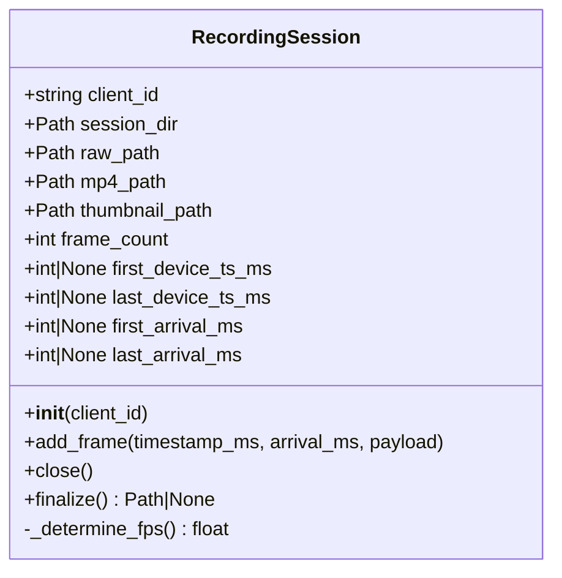
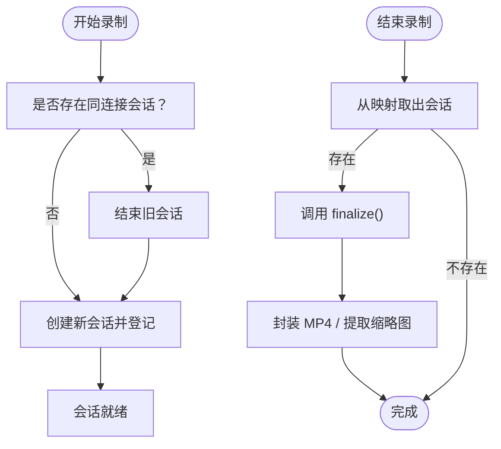
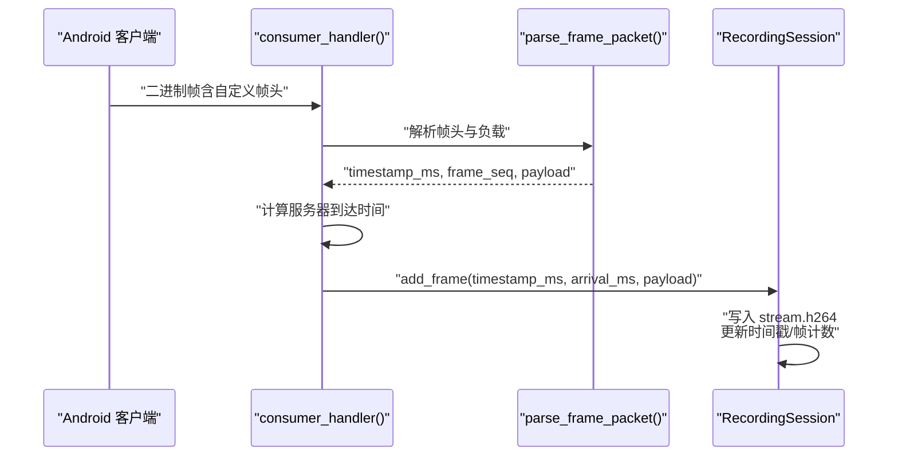
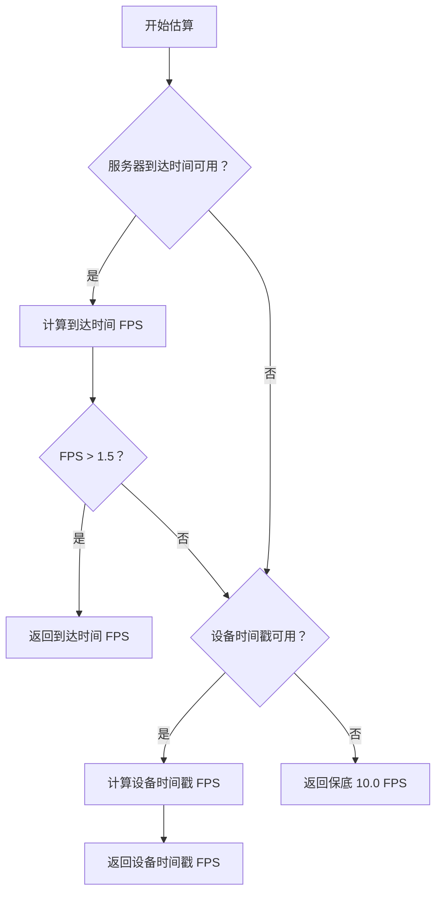
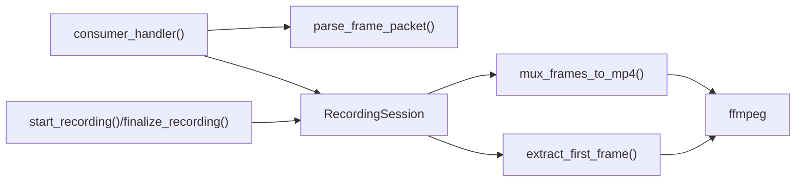

# 录制会话管理

<cite>
**本文引用的文件**
- [server.py](file://backend/server.py)
- [README.md](file://backend/README.md)
</cite>

## 目录
1. [简介](#简介)
2. [项目结构](#项目结构)
3. [核心组件](#核心组件)
4. [架构总览](#架构总览)
5. [详细组件分析](#详细组件分析)
6. [依赖关系分析](#依赖关系分析)
7. [性能考量](#性能考量)
8. [故障排查指南](#故障排查指南)
9. [结论](#结论)

## 简介
本文件聚焦于 lab-log 项目的后端录制会话管理功能，围绕 RecordingSession 类展开，系统性说明其设计与实现要点，包括：
- 会话目录与文件组织
- 帧数据写入与时间戳记录
- 录制开始与结束流程
- 会话状态跟踪与资源释放策略
- FPS 估算与 MP4 封装

## 项目结构
后端核心逻辑集中在 backend/server.py，配套说明见 backend/README.md。WebSocket 服务监听端口 50001，接收来自 Android 客户端的二进制 H.264 帧与文本状态消息，按会话写入磁盘并在结束时封装为 MP4。

图表来源
- [server.py](file://backend/server.py#L210-L231)
- [server.py](file://backend/server.py#L234-L303)
- [server.py](file://backend/server.py#L26-L133)
- [server.py](file://backend/server.py#L150-L207)

章节来源
- [server.py](file://backend/server.py#L1-L440)
- [README.md](file://backend/README.md#L1-L291)

## 核心组件
- RecordingSession：管理单个 Android 客户端的录制生命周期，负责会话目录创建、原始 H.264 写入、时间戳记录、最终封装与缩略图提取。
- start_recording / finalize_recording：在状态消息或连接断开时协调会话的开启与结束。
- consumer_handler：统一处理文本状态与二进制帧，驱动 RecordingSession 的 add_frame 流程。
- mux_frames_to_mp4 / extract_first_frame：封装与提取缩略图的辅助函数。

章节来源
- [server.py](file://backend/server.py#L26-L133)
- [server.py](file://backend/server.py#L150-L207)
- [server.py](file://backend/server.py#L210-L231)
- [server.py](file://backend/server.py#L234-L303)

## 架构总览
下图展示从连接建立到录制结束的关键交互路径，以及 RecordingSession 在其中的角色。

图表来源
- [server.py](file://backend/server.py#L234-L303)
- [server.py](file://backend/server.py#L210-L231)
- [server.py](file://backend/server.py#L26-L133)
- [server.py](file://backend/server.py#L150-L207)

## 详细组件分析

### RecordingSession 类设计与实现
- 会话目录与文件组织
  - 构造函数根据客户端标识与当前时间生成唯一目录名，创建 recordings/<client>_<timestamp>/，并在其中初始化 stream.h264、stream.mp4、thumbnail.jpg 的路径。
  - 会话对象维护帧计数与首尾设备时间戳、首尾服务器到达时间，用于后续 FPS 估算与日志记录。
- add_frame：接收解析后的 H.264 帧数据，写入原始比特流文件；同时记录设备时间戳与服务器到达时间，用于后续估算。
- finalize：关闭原始文件，估算 FPS，调用 ffmpeg 将 H.264 封装为 MP4，并提取首帧作为缩略图。
- _determine_fps：优先使用服务器到达时间估算，若不可信则回退到设备时间戳；两者均不可用时使用保底值。

图表来源
- [server.py](file://backend/server.py#L26-L133)

章节来源
- [server.py](file://backend/server.py#L26-L133)

### 录制开始与结束流程
- start_recording：当收到 capture_started 状态时，若已有同连接的会话则先结束旧会话，再创建新的 RecordingSession 并登记到全局映射中。
- finalize_recording：从全局映射移除会话并调用其 finalize，打印结果；无论是否生成 MP4，都会确保资源释放。

图表来源
- [server.py](file://backend/server.py#L210-L231)

章节来源
- [server.py](file://backend/server.py#L210-L231)

### 帧接收与写入流程
- consumer_handler：区分文本状态与二进制帧两类消息；二进制帧在存在活动会话的前提下解析帧头，获取设备时间戳、帧序号与负载长度，随后计算服务器到达时间并调用 session.add_frame。
- parse_frame_packet：严格校验帧头长度与负载长度一致性，返回设备时间戳、帧序号与裸 H.264 负载。

图表来源
- [server.py](file://backend/server.py#L234-L303)
- [server.py](file://backend/server.py#L135-L148)
- [server.py](file://backend/server.py#L49-L59)

章节来源
- [server.py](file://backend/server.py#L234-L303)
- [server.py](file://backend/server.py#L135-L148)
- [server.py](file://backend/server.py#L49-L59)

### FPS 估算与 MP4 封装
- _determine_fps：优先使用服务器到达时间估算，要求大于 1.5fps 才采用；否则回退到设备时间戳；若仍不可用则使用保底 10.0fps。
- mux_frames_to_mp4：通过 ffmpeg 以 -f h264 指定输入格式、-r <fps> 指定帧率、-c:v copy 直接拷贝视频轨，避免重编码。
- extract_first_frame：从 H.264 中抽取首帧保存为 JPEG 缩略图。

图表来源
- [server.py](file://backend/server.py#L80-L133)
- [server.py](file://backend/server.py#L150-L207)

章节来源
- [server.py](file://backend/server.py#L80-L133)
- [server.py](file://backend/server.py#L150-L207)

### 会话状态跟踪与资源释放
- 全局字典 RECORDING_SESSIONS：以 WebSocket 对象为键，RecordingSession 为值，用于在状态消息与连接断开时定位并结束会话。
- 连接断开处理：consumer_handler 在 finally 分支中调用 finalize_recording，确保即使异常也会释放资源。
- 断开后清理：connection_handler 在 finally 分支中从全局集合移除连接，避免悬挂引用。

章节来源
- [server.py](file://backend/server.py#L21-L24)
- [server.py](file://backend/server.py#L234-L303)
- [server.py](file://backend/server.py#L282-L303)

## 依赖关系分析
- 外部工具：ffmpeg（通过环境变量可配置路径），用于封装与提取缩略图。
- Python 库：websockets，用于 WebSocket 通信。
- 关键内部依赖链：
  - consumer_handler 依赖 parse_frame_packet 与 RecordingSession.add_frame
  - start_recording/finalize_recording 依赖 RecordingSession 生命周期管理
  - RecordingSession.finalize 依赖 mux_frames_to_mp4 与 extract_first_frame

图表来源
- [server.py](file://backend/server.py#L135-L148)
- [server.py](file://backend/server.py#L210-L231)
- [server.py](file://backend/server.py#L234-L303)
- [server.py](file://backend/server.py#L150-L207)

章节来源
- [server.py](file://backend/server.py#L135-L148)
- [server.py](file://backend/server.py#L210-L231)
- [server.py](file://backend/server.py#L234-L303)
- [server.py](file://backend/server.py#L150-L207)

## 性能考量
- 无重编码：通过 -c:v copy 直接拷贝视频轨，显著降低 CPU 占用与延迟。
- 显式帧率：使用 -r <fps> 避免 ffmpeg 错误推断导致时间轴异常。
- 时间戳估算：优先使用服务器到达时间，更贴近真实接收节奏；在极端情况下回退到设备时间戳或保底值，保证稳定性。
- 文件写入：以二进制模式追加写入 stream.h264，避免额外编码开销。

章节来源
- [server.py](file://backend/server.py#L150-L207)
- [README.md](file://backend/README.md#L89-L114)

## 故障排查指南
- 无法生成 MP4
  - 检查 ffmpeg 是否安装并可在命令行直接调用；必要时设置环境变量 FFMPEG_BIN 指向可执行文件路径。
  - 查看封装过程的返回码与 stderr 输出，确认裸 H.264 文件是否存在。
- 录制结束后缺少缩略图
  - 检查 extract_first_frame 的返回值与 stderr 输出；确认 H.264 文件存在且可读。
- FPS 估算异常
  - 若服务器到达时间缺失或波动过大，将回退到设备时间戳；若两者均不可用，则使用保底 10.0fps。
- 连接断开未生成 MP4
  - 确认 consumer_handler 的 finally 分支是否执行 finalize_recording；检查 RECORDING_SESSIONS 中是否存在对应条目。
- 帧头解析失败
  - 检查二进制帧长度与负载长度一致性；确认帧头格式与大小端约定一致。

章节来源
- [server.py](file://backend/server.py#L150-L207)
- [server.py](file://backend/server.py#L234-L303)
- [server.py](file://backend/server.py#L80-L133)

## 结论
RecordingSession 通过清晰的生命周期管理与稳健的时间戳记录，实现了从帧接收、原始码流写入到最终封装与缩略图提取的完整闭环。配合 start_recording/finalize_recording 与 consumer_handler 的协作，系统在连接断开或状态切换时也能可靠地释放资源并生成可用的 MP4 文件。通过显式帧率与直拷贝策略，兼顾性能与质量，适合在资源受限的环境中稳定运行。