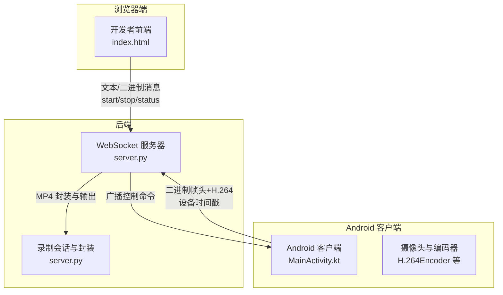
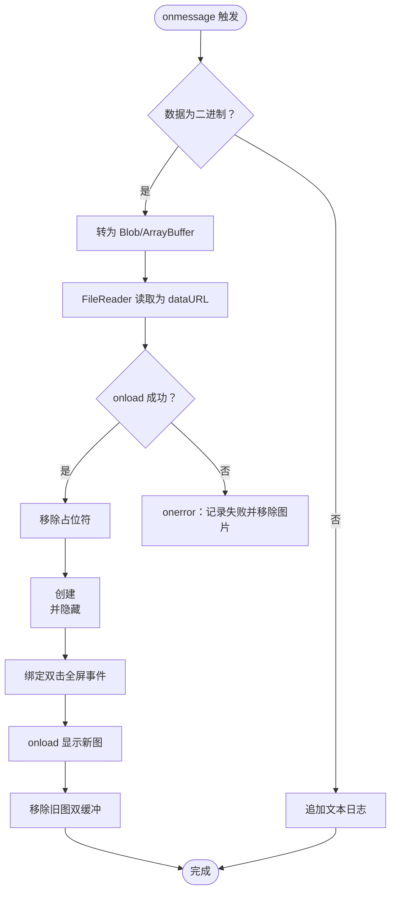
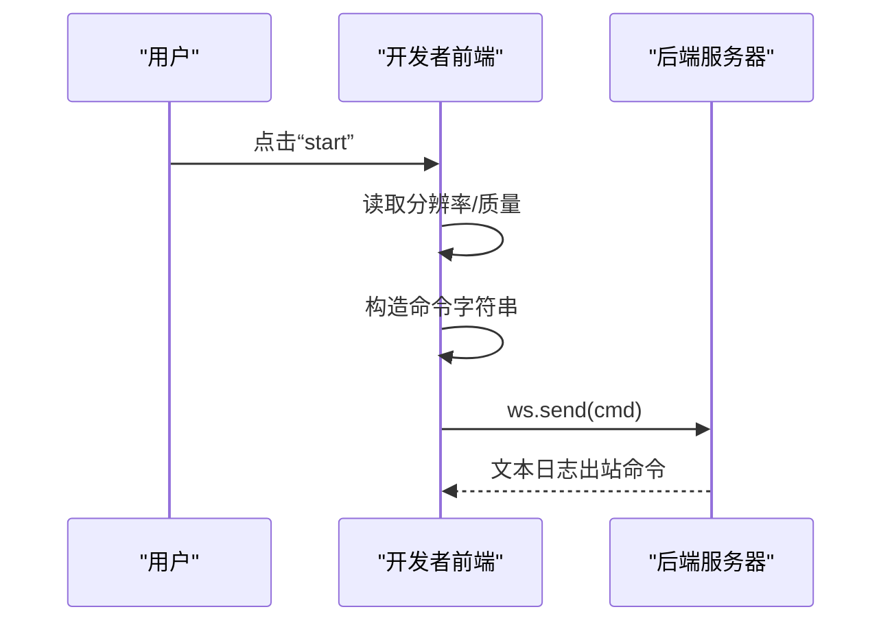
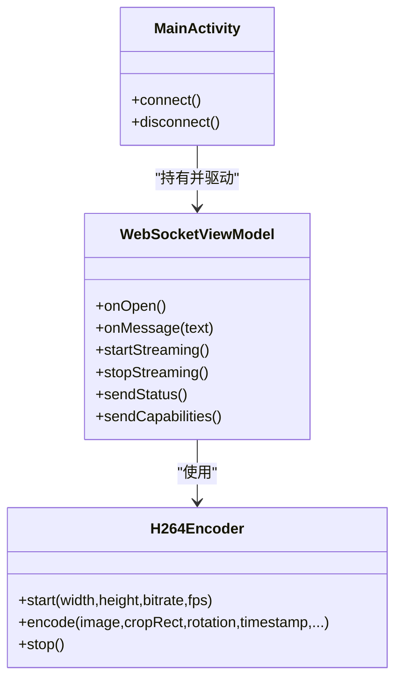
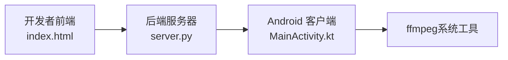

# 开发者前端

<cite>
**本文引用的文件**
- [index.html](file://developer-frontend/index.html)
- [server.py](file://backend/server.py)
- [README.md](file://backend/README.md)
- [AndroidManifest.xml](file://android-camera/app/src/main/AndroidManifest.xml)
- [MainActivity.kt](file://android-camera/app/src/main/java/com/example/lablogcamera/MainActivity.kt)
</cite>

## 目录
1. [简介](#简介)
2. [项目结构](#项目结构)
3. [核心组件](#核心组件)
4. [架构总览](#架构总览)
5. [详细组件分析](#详细组件分析)
6. [依赖关系分析](#依赖关系分析)
7. [性能考量](#性能考量)
8. [故障排查指南](#故障排查指南)
9. [结论](#结论)
10. [附录](#附录)

## 简介
本文件面向 lab-log 项目的开发者前端，聚焦于“开发者控制台”（developer-frontend）的设计与实现。该前端是一个轻量级的无框架网页应用，通过 WebSocket 与后端服务器交互，用于：
- 监控与控制 Android 客户端的视频采集过程
- 展示连接状态、服务器日志与实时画面
- 将用户操作（开始/停止录制、查询状态、自定义命令）转换为文本或二进制消息发送给后端，并由后端广播至 Android 客户端

该控制台具备以下特点：
- 无第三方 JS 框架，纯 HTML/CSS/内联 JavaScript
- 通过 WebSocket 接收二进制帧（图片/JPEG）与文本日志
- 通过按钮与表单构建命令，发送给后端
- 支持全屏预览与键盘快捷键

## 项目结构
开发者前端位于 developer-frontend/index.html，后端位于 backend/server.py，Android 客户端位于 android-camera/app/src/main/java/com/example/lablogcamera/MainActivity.kt。Android 客户端的清单文件声明了必要的权限与网络配置。



图表来源
- [index.html](file://developer-frontend/index.html#L224-L569)
- [server.py](file://backend/server.py#L233-L324)
- [MainActivity.kt](file://android-camera/app/src/main/java/com/example/lablogcamera/MainActivity.kt#L867-L942)

章节来源
- [index.html](file://developer-frontend/index.html#L224-L569)
- [server.py](file://backend/server.py#L233-L324)
- [MainActivity.kt](file://android-camera/app/src/main/java/com/example/lablogcamera/MainActivity.kt#L867-L942)

## 核心组件
- HTML 结构与布局
  - 采用语义化的 header/main/footer 结构，使用 CSS Grid 布局划分“连接配置”、“日志”、“摄像头画面”三大面板。
  - 关键节点包括：连接状态展示、URL 输入、连接/断开按钮、分辨率与质量选择、start/stop/status 按钮、自定义命令输入、日志容器、摄像头画面容器与全屏按钮。
- CSS 样式
  - 深色主题配色，强调对比度；网格布局适配不同屏幕尺寸；日志与画面区域具备滚动与自适应高度。
  - 摄像头画面支持 hover 显示全屏按钮，全屏状态下增强视觉效果与交互。
- 内联 JavaScript
  - WebSocket 连接生命周期管理：连接、断开、错误、消息处理
  - 命令构建与发送：start/stop/status 与自定义命令
  - 二进制消息处理：将二进制帧转为 JPEG 并显示，支持双击/快捷键全屏
  - 日志与状态展示：系统日志、入站/出站消息分类显示

章节来源
- [index.html](file://developer-frontend/index.html#L224-L569)

## 架构总览
开发者前端作为轻量级控制台，承担以下职责：
- 与后端服务器建立 WebSocket 连接，接收服务端日志与 Android 客户端推送的二进制帧（图片）
- 将用户操作转换为命令文本，发送给后端
- 后端将命令广播给所有已连接的 Android 客户端，客户端据此开始/停止采集并上报状态
- 服务器在录制结束时生成 MP4，供后续回放与分析

```mermaid
sequenceDiagram
participant U as "用户"
participant FE as "开发者前端<br/>index.html"
participant WS as "后端服务器<br/>server.py"
participant AND as "Android 客户端<br/>MainActivity.kt"
U->>FE : 点击“连接”
FE->>WS : 建立 WebSocket 连接
WS-->>FE : onopen连接成功
U->>FE : 点击“start”
FE->>WS : 发送命令start/分辨率/质量
WS-->>AND : 广播 start_capture 命令
AND-->>WS : 上报 capture_started 状态
WS-->>FE : 文本日志状态
AND-->>WS : 推送二进制帧设备时间戳+H.264
WS-->>FE : onmessage二进制帧
FE->>FE : 读取二进制为图片并显示
U->>FE : 点击“stop”
FE->>WS : 发送 stop 命令
WS-->>AND : 广播 stop_capture 命令
AND-->>WS : 上报 capture_stopped 状态
WS-->>FE : 文本日志状态
```

图表来源
- [index.html](file://developer-frontend/index.html#L347-L453)
- [server.py](file://backend/server.py#L233-L324)
- [MainActivity.kt](file://android-camera/app/src/main/java/com/example/lablogcamera/MainActivity.kt#L867-L942)

## 详细组件分析

### HTML 结构与 CSS 样式
- 结构要点
  - header：标题与连接状态展示
  - main.grid：三列布局，左侧为“连接配置/命令控制”，中间为“日志”，右侧为“摄像头画面”
  - panel：统一的卡片式容器，包含标题与内容区域
  - 摄像头画面容器：支持占位符与图片动态替换，hover 显示全屏按钮
- 样式要点
  - 深色背景与高对比度文本，适合长时间观察
  - 日志区域与画面区域均设置滚动与自适应高度
  - 全屏状态下背景变黑，按钮放大，提升观看体验

章节来源
- [index.html](file://developer-frontend/index.html#L224-L295)

### 内联 JavaScript：WebSocket 连接与消息处理
- 连接管理
  - defaultWsUrl：默认服务器地址与路径
  - setStatus：连接状态文本与颜色
  - updateButtons：根据连接状态禁用/启用按钮
  - connect/disconnect：建立/关闭连接，注册 onopen/onclose/onerror/onmessage
- 命令发送
  - sendCommand：发送文本命令（start/stop/status/自定义）
  - start/stop/status 按钮事件：读取分辨率与质量参数，构造命令字符串
- 二进制消息处理（图片）
  - onmessage：区分二进制与文本
  - 二进制：Blob/ArrayBuffer -> FileReader -> dataURL ->  -> 双缓冲无缝切换
  - 文本：追加到日志区域
- 全屏功能
  - toggleFullscreen：支持多种浏览器厂商前缀
  - 键盘快捷键：F11 切换全屏，Esc 退出全屏
  - 全屏状态变更事件：更新按钮文案



图表来源
- [index.html](file://developer-frontend/index.html#L379-L450)

章节来源
- [index.html](file://developer-frontend/index.html#L347-L564)

### 命令构建与发送流程
- start 命令
  - 读取分辨率与质量参数，拼接为“start 分辨率 质量”
  - 若仅提供分辨率或质量之一，仍可发送
- stop/status/custom
  - 直接发送对应字符串
- 自定义命令
  - 支持回车提交与按钮提交



图表来源
- [index.html](file://developer-frontend/index.html#L533-L557)

章节来源
- [index.html](file://developer-frontend/index.html#L533-L557)

### 后端服务器：消息处理与广播
- 连接入口
  - connection_handler：记录客户端 ID 与路径，加入全局集合 CONNECTED_CLIENTS
- 消费者处理
  - 文本消息：解析 JSON，识别 capture_started/capture_stopped，开启/结束录制会话
  - 二进制消息：解析自定义帧头（设备时间戳、帧序号、负载长度），写入会话并记录时间戳
- 广播控制命令
  - terminal_input_handler：从终端读取 start/stop 命令，转换为 JSON 广播给所有客户端
  - broadcast：并发发送，记录失败客户端

```mermaid
sequenceDiagram
participant AND as "Android 客户端"
participant WS as "后端服务器"
participant FE as "开发者前端"
AND->>WS : 发送 JSON 状态capture_started/capture_stopped
WS->>WS : start_recording/finalize_recording
WS-->>FE : 文本日志状态
AND->>WS : 发送二进制帧帧头+H.264
WS->>WS : parse_frame_packet() 解析
WS->>WS : add_frame() 追加
WS-->>FE : 文本日志帧统计
```

图表来源
- [server.py](file://backend/server.py#L233-L324)
- [README.md](file://backend/README.md#L127-L169)

章节来源
- [server.py](file://backend/server.py#L233-L324)
- [README.md](file://backend/README.md#L127-L169)

### Android 客户端：命令接收与采集控制
- WebSocket 连接
  - onOpen：上报 ready 状态与设备能力（分辨率列表等）
  - onMessage：解析 start_capture/stop_capture 命令，启动/停止采集
- 采集与编码
  - H.264Encoder：配置编码器，将 YUV 转 NV12，编码为 H.264
  - 自定义帧头：8字节时间戳 + 4字节帧序号 + 4字节负载长度 + H.264 负载
  - 速率控制：按目标 FPS 主动丢帧，避免超发
- 状态上报
  - capture_started/capture_stopped：上报给后端，触发服务器会话生命周期



图表来源
- [MainActivity.kt](file://android-camera/app/src/main/java/com/example/lablogcamera/MainActivity.kt#L867-L942)
- [MainActivity.kt](file://android-camera/app/src/main/java/com/example/lablogcamera/MainActivity.kt#L944-L1200)
- [MainActivity.kt](file://android-camera/app/src/main/java/com/example/lablogcamera/MainActivity.kt#L1200-L1242)

章节来源
- [MainActivity.kt](file://android-camera/app/src/main/java/com/example/lablogcamera/MainActivity.kt#L867-L942)
- [MainActivity.kt](file://android-camera/app/src/main/java/com/example/lablogcamera/MainActivity.kt#L944-L1200)
- [MainActivity.kt](file://android-camera/app/src/main/java/com/example/lablogcamera/MainActivity.kt#L1200-L1242)

## 依赖关系分析
- 前端依赖
  - 浏览器原生 WebSocket API
  - FileReader 读取二进制帧为 dataURL
  - DOM API 操作节点与样式
- 后端依赖
  - Python websockets 库
  - ffmpeg（系统工具）用于 MP4 封装
- Android 客户端依赖
  - OkHttp WebSocket
  - CameraX + MediaCodec 进行采集与编码
  - JSON 解析与序列化



图表来源
- [index.html](file://developer-frontend/index.html#L224-L569)
- [server.py](file://backend/server.py#L233-L324)
- [MainActivity.kt](file://android-camera/app/src/main/java/com/example/lablogcamera/MainActivity.kt#L867-L942)

章节来源
- [index.html](file://developer-frontend/index.html#L224-L569)
- [server.py](file://backend/server.py#L233-L324)
- [MainActivity.kt](file://android-camera/app/src/main/java/com/example/lablogcamera/MainActivity.kt#L867-L942)

## 性能考量
- 前端
  - 双缓冲显示图片，避免闪烁与重绘抖动
  - FileReader 异步读取，onload 后再显示，避免阻塞主线程
  - 日志区域自动滚动到底部，便于观察最新消息
- 后端
  - 二进制帧头固定 16 字节，解析高效
  - 使用 asyncio.gather 并发广播，记录失败客户端
  - 录制结束后通过 ffmpeg 直接拷贝视频轨，避免重编码
- Android 客户端
  - 以硬件支持的最大分辨率进行 ImageAnalysis，最大化 FOV
  - 主动丢帧控制发送速率，降低网络压力
  - 旋转与裁剪在 Android 端完成，后端不再旋转

章节来源
- [index.html](file://developer-frontend/index.html#L379-L450)
- [server.py](file://backend/server.py#L233-L324)
- [MainActivity.kt](file://android-camera/app/src/main/java/com/example/lablogcamera/MainActivity.kt#L944-L1200)

## 故障排查指南
- 无法连接
  - 检查 URL 是否正确，默认地址与路径固定
  - 查看浏览器控制台 WebSocket 错误
  - 确认后端服务器已启动并监听端口
- 无法接收图片
  - 确认 Android 客户端已开始采集并发送帧
  - 检查后端日志是否出现帧头解析错误
- 命令无效
  - 确认已连接后再发送命令
  - 检查后端终端是否收到 start/stop 命令
- 录制完成后无 MP4
  - 检查 ffmpeg 是否安装并可在命令行调用
  - 查看后端日志中的封装失败信息

章节来源
- [index.html](file://developer-frontend/index.html#L347-L453)
- [server.py](file://backend/server.py#L233-L324)
- [README.md](file://backend/README.md#L127-L169)

## 结论
开发者前端以极简实现提供了完整的视频采集控制与监控能力：
- 通过 WebSocket 与后端/客户端形成闭环，支持实时日志与画面展示
- 命令简洁直观，易于调试与演示
- 作为演示与调试工具价值显著；未来可扩展为功能完整的管理界面（如录制历史、设备能力展示、参数持久化等）

## 附录
- Android 权限与网络配置
  - CAMERA、INTERNET 权限
  - 网络安全配置（如需明文 HTTP）

章节来源
- [AndroidManifest.xml](file://android-camera/app/src/main/AndroidManifest.xml#L1-L32)