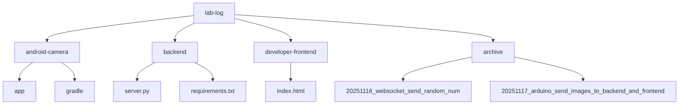
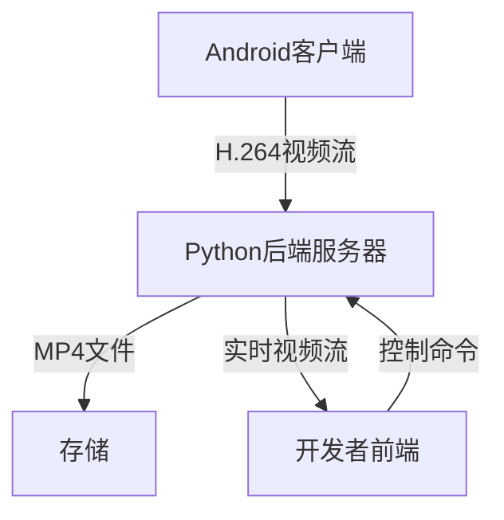
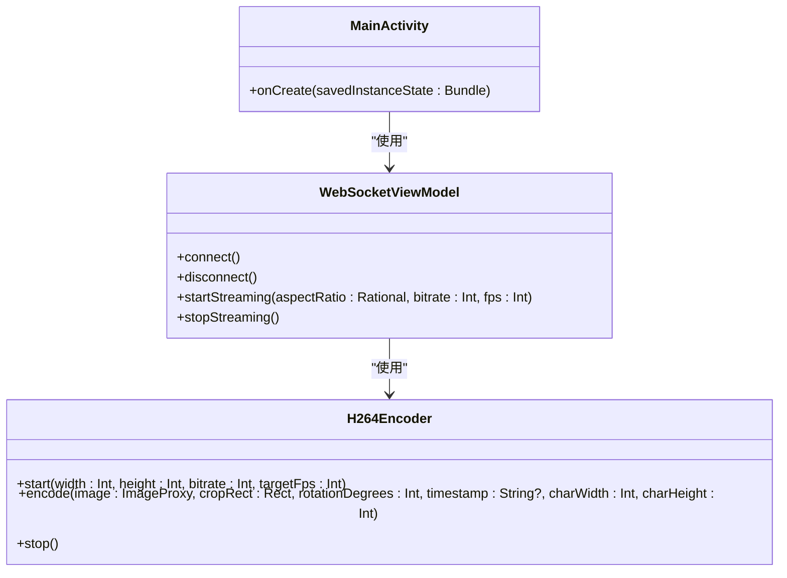
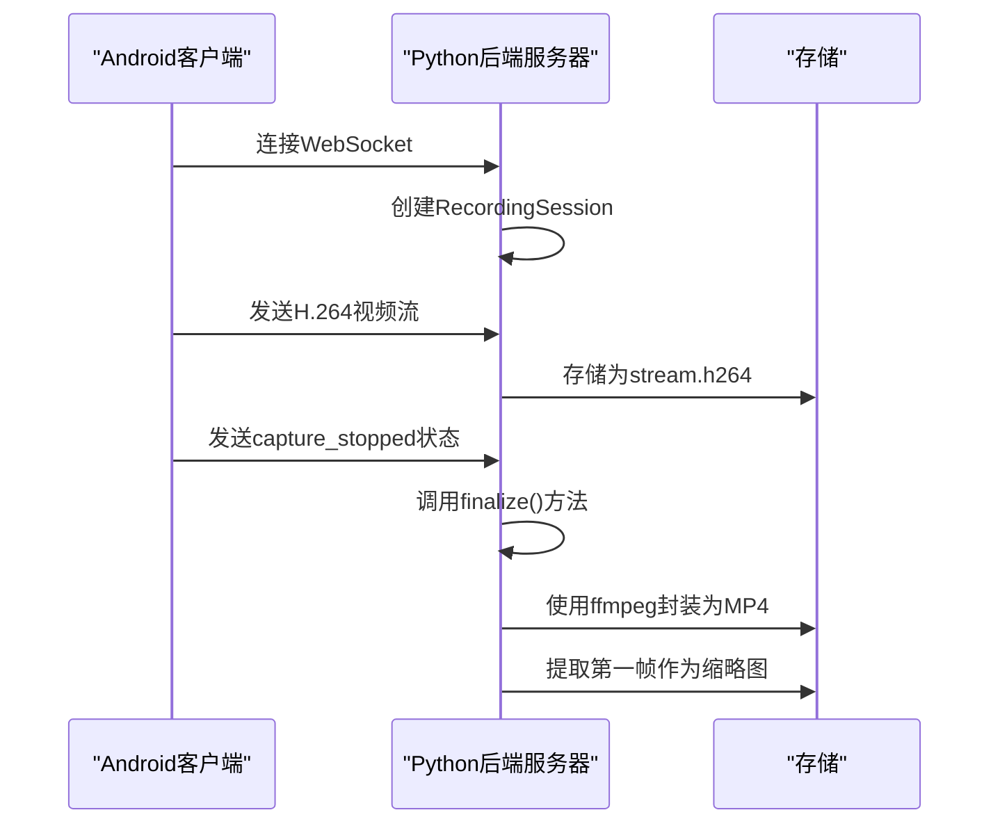
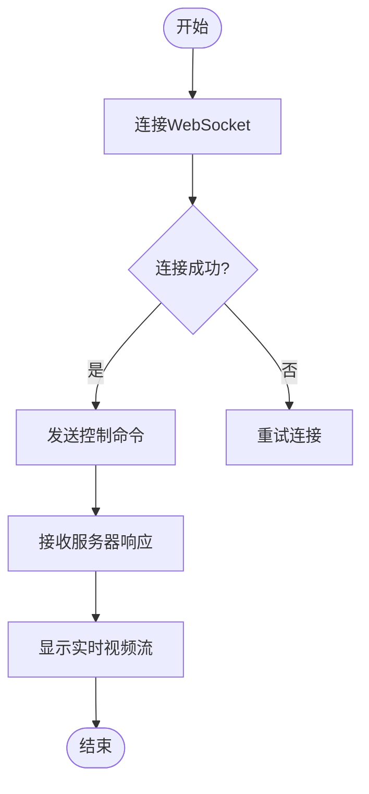
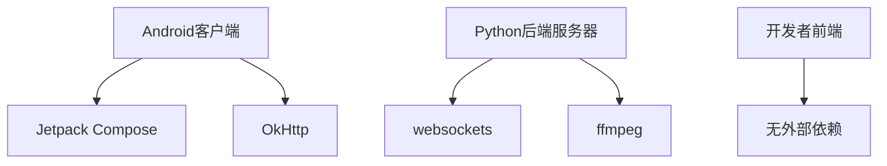

# 技术架构

<cite>
**本文档引用的文件**
- [server.py](file://backend/server.py)
- [MainActivity.kt](file://android-camera/app/src/main/java/com/example/lablogcamera/MainActivity.kt)
- [index.html](file://developer-frontend/index.html)
- [AndroidManifest.xml](file://android-camera/app/src/main/AndroidManifest.xml)
- [requirements.txt](file://backend/requirements.txt)
- [build.gradle.kts](file://android-camera/build.gradle.kts)
- [libs.versions.toml](file://android-camera/gradle/libs.versions.toml)
</cite>

## 目录

1. [简介](#简介)
2. [项目结构](#项目结构)
3. [核心组件](#核心组件)
4. [架构概览](#架构概览)
5. [详细组件分析](#详细组件分析)
6. [依赖分析](#依赖分析)
7. [性能考虑](#性能考虑)
8. [故障排除指南](#故障排除指南)
9. [结论](#结论)

## 简介

lab-log项目是一个用于实验室环境的视频记录系统，由三个主要部分组成：一个Android客户端应用、一个Python后端服务器和一个开发者前端控制台。该系统旨在通过WebSocket协议实现从移动设备到服务器的实时视频流传输，并支持通过开发者前端进行远程控制。本架构文档详细描述了系统的高阶设计，包括Android端的MVVM（Model-View-ViewModel）架构模式和后端的事件驱动架构模式。文档还涵盖了系统边界、组件交互、数据流和控制流，以及使用WebSocket进行实时视频流传输的技术决策和权衡。

## 项目结构

lab-log项目的目录结构清晰地划分了各个组件。`android-camera/`目录包含Android客户端应用的源代码，使用Kotlin和Jetpack Compose构建。`backend/`目录包含Python后端服务器的源代码，负责接收和处理视频流。`developer-frontend/`目录包含一个简单的HTML前端，用于开发者调试和控制。`archive/`目录包含历史版本和实验性代码。

**Diagram sources**
- [backend/server.py](file://backend/server.py#L1-L440)
- [android-camera/app/src/main/java/com/example/lablogcamera/MainActivity.kt](file://android-camera/app/src/main/java/com/example/lablogcamera/MainActivity.kt#L1-L2108)
- [developer-frontend/index.html](file://developer-frontend/index.html#L1-L569)

**Section sources**
- [backend/server.py](file://backend/server.py#L1-L440)
- [android-camera/app/src/main/java/com/example/lablogcamera/MainActivity.kt](file://android-camera/app/src/main/java/com/example/lablogcamera/MainActivity.kt#L1-L2108)
- [developer-frontend/index.html](file://developer-frontend/index.html#L1-L569)

## 核心组件

lab-log项目的核心组件包括Android客户端、Python后端服务器和开发者前端。Android客户端使用MVVM架构模式，将用户界面与业务逻辑分离。后端服务器采用事件驱动架构，通过WebSocket协议处理实时视频流。开发者前端提供了一个简单的Web界面，用于监控和控制视频流。

**Section sources**
- [backend/server.py](file://backend/server.py#L1-L440)
- [android-camera/app/src/main/java/com/example/lablogcamera/MainActivity.kt](file://android-camera/app/src/main/java/com/example/lablogcamera/MainActivity.kt#L1-L2108)
- [developer-frontend/index.html](file://developer-frontend/index.html#L1-L569)

## 架构概览

lab-log系统的架构可以分为三个主要部分：Android客户端、Python后端服务器和开发者前端。Android客户端负责采集视频并将其编码为H.264格式，然后通过WebSocket发送到后端服务器。后端服务器接收视频流，将其存储为裸H.264文件，并在录制结束后使用ffmpeg将其封装为MP4文件。开发者前端通过WebSocket连接到后端服务器，可以发送控制命令并查看实时视频流。

**Diagram sources**
- [backend/server.py](file://backend/server.py#L1-L440)
- [android-camera/app/src/main/java/com/example/lablogcamera/MainActivity.kt](file://android-camera/app/src/main/java/com/example/lablogcamera/MainActivity.kt#L1-L2108)
- [developer-frontend/index.html](file://developer-frontend/index.html#L1-L569)

## 详细组件分析

### Android客户端分析

Android客户端使用MVVM架构模式，将用户界面与业务逻辑分离。`MainActivity.kt`是应用的入口点，负责初始化UI和ViewModel。`WebSocketViewModel`负责管理WebSocket连接和视频流的编码与发送。

#### 对象导向组件

**Diagram sources**
- [android-camera/app/src/main/java/com/example/lablogcamera/MainActivity.kt](file://android-camera/app/src/main/java/com/example/lablogcamera/MainActivity.kt#L1-L2108)

### Python后端服务器分析

Python后端服务器采用事件驱动架构，使用`websockets`库处理WebSocket连接。`server.py`是服务器的主文件，负责监听WebSocket连接、接收视频流并将其存储为文件。

#### API/服务组件

**Diagram sources**
- [backend/server.py](file://backend/server.py#L1-L440)

### 开发者前端分析

开发者前端是一个简单的HTML页面，使用JavaScript与后端服务器进行WebSocket通信。它允许开发者发送控制命令并查看实时视频流。

#### 复杂逻辑组件

**Diagram sources**
- [developer-frontend/index.html](file://developer-frontend/index.html#L1-L569)

**Section sources**
- [backend/server.py](file://backend/server.py#L1-L440)
- [android-camera/app/src/main/java/com/example/lablogcamera/MainActivity.kt](file://android-camera/app/src/main/java/com/example/lablogcamera/MainActivity.kt#L1-L2108)
- [developer-frontend/index.html](file://developer-frontend/index.html#L1-L569)

## 依赖分析

lab-log项目的依赖关系清晰。Android客户端依赖于Jetpack Compose和OkHttp库。Python后端服务器依赖于`websockets`库和`ffmpeg`工具。开发者前端不依赖任何外部库。

**Diagram sources**
- [backend/requirements.txt](file://backend/requirements.txt#L1-L3)
- [android-camera/gradle/libs.versions.toml](file://android-camera/gradle/libs.versions.toml#L1-L33)

**Section sources**
- [backend/requirements.txt](file://backend/requirements.txt#L1-L3)
- [android-camera/gradle/libs.versions.toml](file://android-camera/gradle/libs.versions.toml#L1-L33)

## 性能考虑

lab-log系统在设计时考虑了性能因素。视频流使用H.264编码，以减少网络带宽消耗。后端服务器使用异步I/O处理WebSocket连接，以提高并发处理能力。视频流在Android端进行旋转和裁剪，以减少后端服务器的计算负担。

## 故障排除指南

如果遇到连接问题，请检查以下几点：
- 确保Android客户端和后端服务器在同一网络中。
- 检查后端服务器的防火墙设置，确保端口50001开放。
- 确保`ffmpeg`已正确安装并可在命令行中调用。

**Section sources**
- [backend/README.md](file://backend/README.md#L1-L291)

## 结论

lab-log项目通过结合Android客户端、Python后端服务器和开发者前端，实现了高效的视频记录和远程控制功能。MVVM架构模式和事件驱动架构模式的结合，使得系统具有良好的可维护性和扩展性。使用WebSocket进行实时视频流传输，确保了低延迟和高可靠性。未来可以考虑增加更多的安全措施和监控功能，以进一步提升系统的稳定性和安全性。