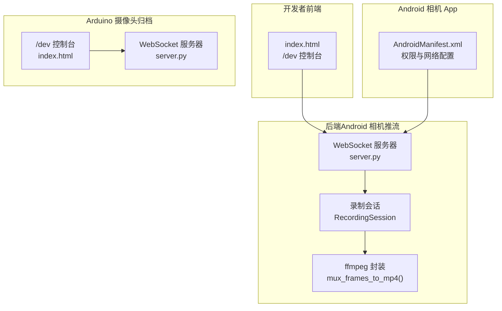
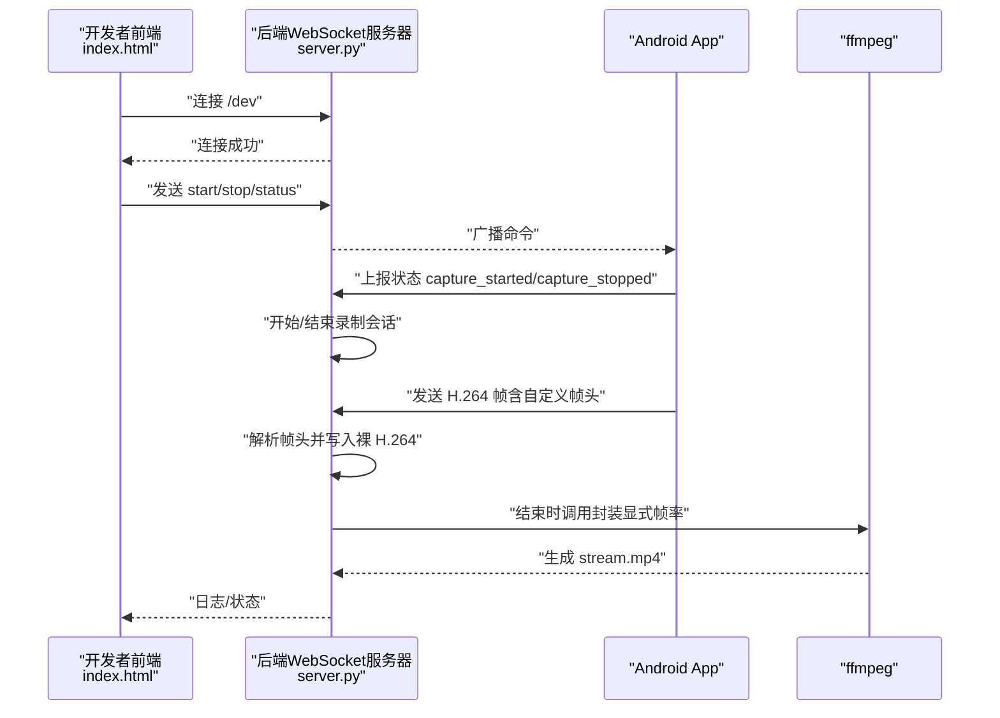
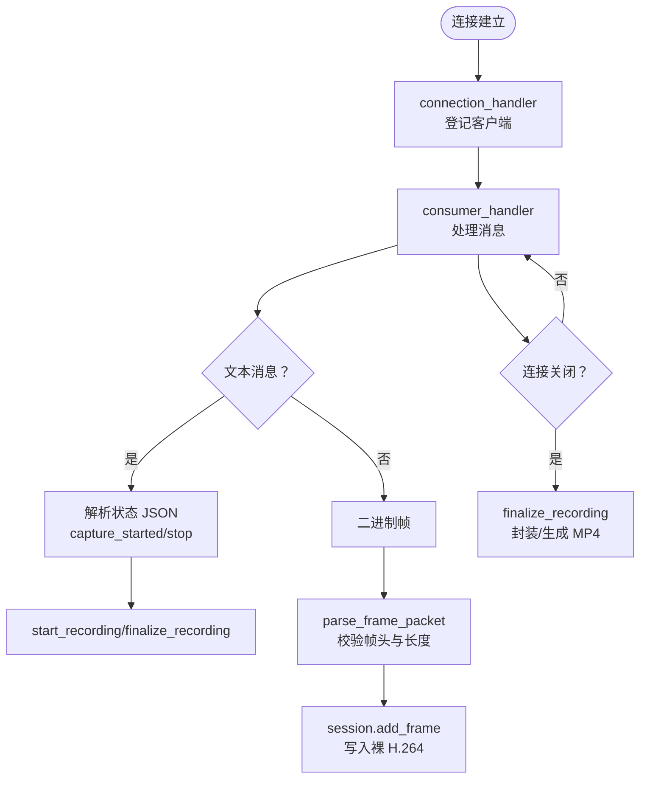
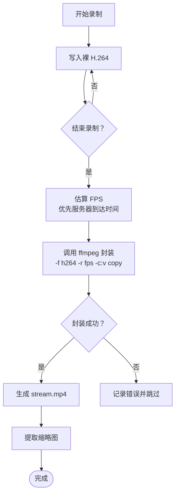
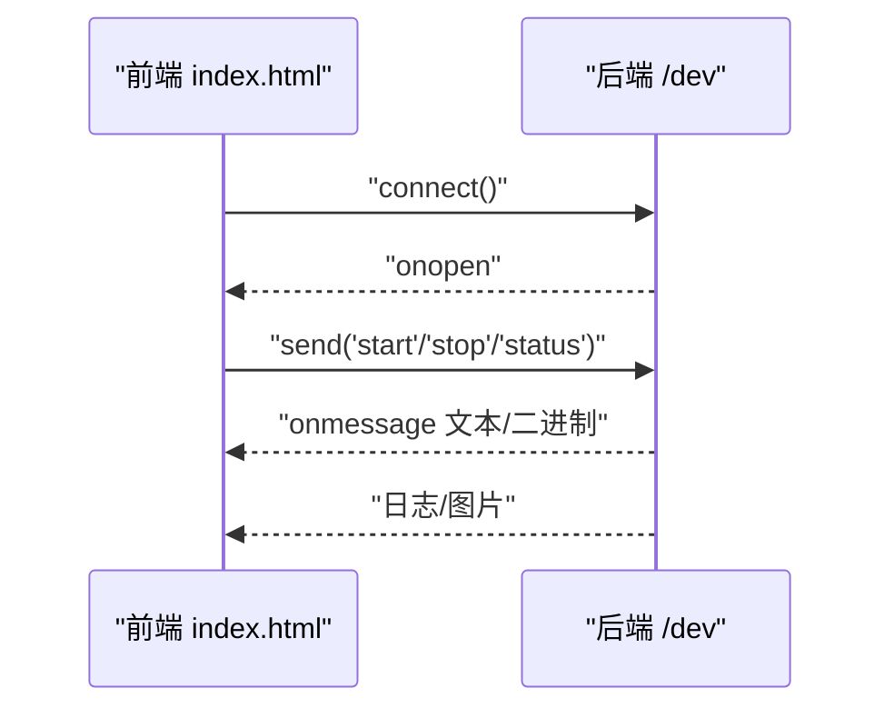
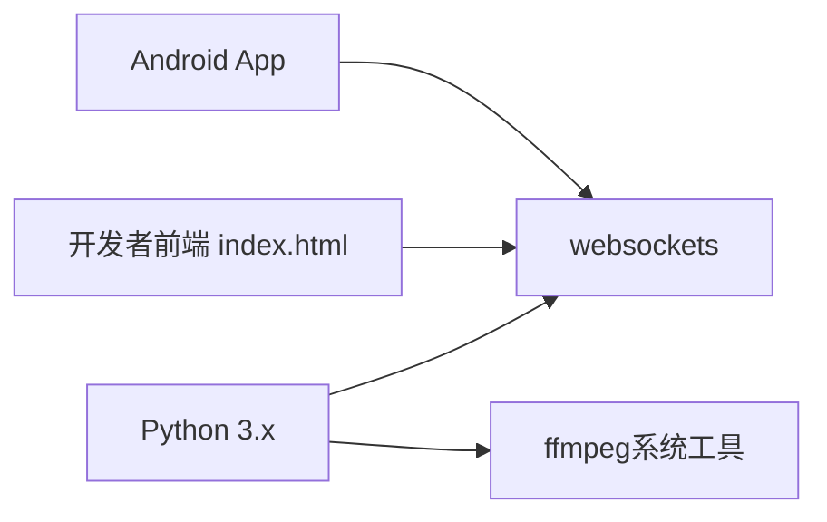

# 故障排除

<cite>
**本文引用的文件**
- [backend/server.py](file://backend/server.py)
- [backend/README.md](file://backend/README.md)
- [backend/requirements.txt](file://backend/requirements.txt)
- [developer-frontend/index.html](file://developer-frontend/index.html)
- [android-camera/app/src/main/AndroidManifest.xml](file://android-camera/app/src/main/AndroidManifest.xml)
- [archive/20251117_arduino_send_images_to_backend_and_frontend/backend/server.py](file://archive/20251117_arduino_send_images_to_backend_and_frontend/backend/server.py)
- [archive/20251117_arduino_send_images_to_backend_and_frontend/developer-frontend/index.html](file://archive/20251117_arduino_send_images_to_backend_and_frontend/developer-frontend/index.html)
</cite>

## 目录
1. [简介](#简介)
2. [项目结构](#项目结构)
3. [核心组件](#核心组件)
4. [架构总览](#架构总览)
5. [详细组件分析](#详细组件分析)
6. [依赖关系分析](#依赖关系分析)
7. [性能考量](#性能考量)
8. [故障排除指南](#故障排除指南)
9. [结论](#结论)

## 简介
本指南聚焦于本仓库中与视频流传输、录制与封装相关的核心问题，提供系统化的排查思路与解决方案，覆盖以下典型问题：
- WebSocket 连接失败
- ffmpeg 封装错误
- H.264 编码器初始化失败（在本仓库中以“H.264 封装失败”形式出现）
- 视频流延迟

同时给出调试技巧，包括如何检查服务器日志中的 [Error]/[Warning] 消息、验证 ffmpeg 是否正确安装、使用开发者前端控制台进行诊断等。最后结合网络带宽与编码参数，给出性能优化建议。

## 项目结构
本仓库包含三套相关但独立的实现：
- 后端（Android 相机推流）：负责接收 Android App 的 H.264 帧，按会话写盘并在结束后封装为 MP4。
- 开发者前端：用于连接后端 /dev 端点，发送命令并实时预览图片（另一套实现）。
- Android 相机 App：Android 端应用，负责采集与推送 H.264 帧至后端。
- Arduino 摄像头（归档示例）：另一套 WebSocket 服务，演示了 /esp 与 /dev 路由及命令转发。

图表来源
- [backend/server.py](file://backend/server.py#L210-L233)
- [backend/server.py](file://backend/server.py#L150-L179)
- [developer-frontend/index.html](file://developer-frontend/index.html#L347-L377)
- [android-camera/app/src/main/AndroidManifest.xml](file://android-camera/app/src/main/AndroidManifest.xml#L1-L32)
- [archive/20251117_arduino_send_images_to_backend_and_frontend/backend/server.py](file://archive/20251117_arduino_send_images_to_backend_and_frontend/backend/server.py#L195-L207)
- [archive/20251117_arduino_send_images_to_backend_and_frontend/developer-frontend/index.html](file://archive/20251117_arduino_send_images_to_backend_and_frontend/developer-frontend/index.html#L347-L377)

章节来源
- [backend/server.py](file://backend/server.py#L210-L233)
- [backend/server.py](file://backend/server.py#L150-L179)
- [developer-frontend/index.html](file://developer-frontend/index.html#L347-L377)
- [android-camera/app/src/main/AndroidManifest.xml](file://android-camera/app/src/main/AndroidManifest.xml#L1-L32)
- [archive/20251117_arduino_send_images_to_backend_and_frontend/backend/server.py](file://archive/20251117_arduino_send_images_to_backend_and_frontend/backend/server.py#L195-L207)
- [archive/20251117_arduino_send_images_to_backend_and_frontend/developer-frontend/index.html](file://archive/20251117_arduino_send_images_to_backend_and_frontend/developer-frontend/index.html#L347-L377)

## 核心组件
- WebSocket 服务器与连接处理：负责建立连接、广播控制命令、处理文本/二进制消息。
- 录制会话 RecordingSession：按客户端与时间戳创建独立目录，写入裸 H.264 流，并在结束时估算 FPS。
- 封装器 mux_frames_to_mp4：调用 ffmpeg 将裸 H.264 封装为 MP4，显式指定帧率避免时间轴错误。
- 开发者前端 /dev 控制台：用于连接后端 /dev，发送 start/stop/status 等命令并预览图片。
- Android App 权限与网络配置：确保相机、网络访问权限与网络安全策略配置正确。

章节来源
- [backend/server.py](file://backend/server.py#L210-L233)
- [backend/server.py](file://backend/server.py#L150-L179)
- [developer-frontend/index.html](file://developer-frontend/index.html#L347-L377)
- [android-camera/app/src/main/AndroidManifest.xml](file://android-camera/app/src/main/AndroidManifest.xml#L1-L32)

## 架构总览
后端服务器采用异步模型，通过 WebSocket 接收来自 Android App 的 H.264 帧，按会话写入磁盘；录制结束后调用 ffmpeg 封装为 MP4。开发者前端通过 /dev 端点连接后端，发送命令并接收图片数据。

图表来源
- [backend/server.py](file://backend/server.py#L234-L303)
- [backend/server.py](file://backend/server.py#L306-L324)
- [backend/server.py](file://backend/server.py#L150-L179)
- [developer-frontend/index.html](file://developer-frontend/index.html#L347-L377)

## 详细组件分析

### WebSocket 连接与消息处理
- 连接入口 connection_handler：记录客户端标识与请求路径，委托 consumer_handler 处理消息。
- 消费者 consumer_handler：区分文本状态消息（JSON）与二进制帧消息（H.264），解析帧头并写入会话。
- 广播 broadcast：向所有已连接客户端发送控制命令。
- 终端输入 terminal_input_handler：解析 start/stop 命令，构造 JSON 广播。

图表来源
- [backend/server.py](file://backend/server.py#L282-L303)
- [backend/server.py](file://backend/server.py#L234-L303)
- [backend/server.py](file://backend/server.py#L135-L148)
- [backend/server.py](file://backend/server.py#L210-L233)

章节来源
- [backend/server.py](file://backend/server.py#L282-L303)
- [backend/server.py](file://backend/server.py#L234-L303)
- [backend/server.py](file://backend/server.py#L135-L148)
- [backend/server.py](file://backend/server.py#L210-L233)

### 录制会话与封装流程
- 录制会话 RecordingSession：创建独立目录，写入 stream.h264，结束时估算 FPS 并调用封装。
- 封装器 mux_frames_to_mp4：显式帧率传入 ffmpeg，使用 -c:v copy 直接拷贝，避免重编码。
- 缩略图提取 extract_first_frame：从 H.264 提取第一帧保存为 JPEG。

图表来源
- [backend/server.py](file://backend/server.py#L49-L80)
- [backend/server.py](file://backend/server.py#L80-L133)
- [backend/server.py](file://backend/server.py#L150-L179)
- [backend/server.py](file://backend/server.py#L181-L207)

章节来源
- [backend/server.py](file://backend/server.py#L49-L80)
- [backend/server.py](file://backend/server.py#L80-L133)
- [backend/server.py](file://backend/server.py#L150-L179)
- [backend/server.py](file://backend/server.py#L181-L207)

### 开发者前端 /dev 控制台
- 连接与状态：连接成功/关闭/错误均有日志与 UI 状态提示。
- 命令发送：支持 start/stop/status 与自定义命令，发送到后端 /dev。
- 图片预览：二进制图片数据转为 base64 显示，支持全屏切换。

图表来源
- [developer-frontend/index.html](file://developer-frontend/index.html#L347-L377)
- [developer-frontend/index.html](file://developer-frontend/index.html#L447-L450)

章节来源
- [developer-frontend/index.html](file://developer-frontend/index.html#L347-L377)
- [developer-frontend/index.html](file://developer-frontend/index.html#L447-L450)

### Android App 权限与网络
- Manifest 声明相机、网络权限与网络安全配置，确保 App 可正常访问网络并使用相机。
- 若 App 无法连接后端，请确认 URL、防火墙与证书策略。

章节来源
- [android-camera/app/src/main/AndroidManifest.xml](file://android-camera/app/src/main/AndroidManifest.xml#L1-L32)

## 依赖关系分析
- Python 依赖：仅 websockets。
- ffmpeg：系统级工具，非 Python 依赖；可通过环境变量指定路径。
- 前端与后端：通过 WebSocket 协议通信；后端支持 /dev 端点。

图表来源
- [backend/requirements.txt](file://backend/requirements.txt#L1-L3)
- [backend/README.md](file://backend/README.md#L278-L291)

章节来源
- [backend/requirements.txt](file://backend/requirements.txt#L1-L3)
- [backend/README.md](file://backend/README.md#L278-L291)

## 性能考量
- 网络带宽与帧率：较高的目标帧率与码率会显著增加网络压力，可能导致丢包与延迟上升。建议根据网络状况调整 start 命令中的 fps 与 bitrate_mb。
- 封装效率：后端使用 -c:v copy 直接拷贝，避免重编码，提升封装速度；显式帧率有助于避免时间轴错误。
- 帧头校验：严格的帧头长度校验可减少无效数据对磁盘与 CPU 的消耗。
- 前端渲染：前端图片预览采用双缓冲与懒加载，降低频繁 DOM 切换带来的卡顿。

章节来源
- [backend/server.py](file://backend/server.py#L150-L179)
- [backend/server.py](file://backend/server.py#L135-L148)
- [developer-frontend/index.html](file://developer-frontend/index.html#L383-L410)

## 故障排除指南

### 1. WebSocket 连接失败
常见症状
- 前端 /dev 页面显示“未连接”或“错误”，控制台有 WebSocket 错误日志。
- 后端终端未看到新的连接日志。

排查步骤
- 检查后端是否在 0.0.0.0:50001 上监听，进程是否正常运行。
- 检查防火墙/安全组是否放行 50001 端口。
- 检查前端 URL 是否正确（默认 ws://pqzc1405495.bohrium.tech:50001/dev）。
- 在浏览器开发者工具 Network 面板查看握手阶段是否有错误。
- 在后端终端查看 [Connection] 日志，确认是否收到新连接。

调试技巧
- 使用开发者前端 /dev 控制台，观察 onopen/onerror/onclose 回调日志。
- 在后端终端输入 start/stop 命令，验证服务器是否能广播到已连接客户端。

章节来源
- [developer-frontend/index.html](file://developer-frontend/index.html#L347-L377)
- [backend/server.py](file://backend/server.py#L282-L303)

### 2. ffmpeg 封装错误
常见症状
- 录制结束后，后端打印 [Error]: ffmpeg failed to mux MP4，并附带 stderr。
- 生成的 stream.mp4 不存在或损坏。

排查步骤
- 确认系统已安装 ffmpeg，并可在命令行直接调用。
- 如 ffmpeg 安装在非标准路径，设置环境变量 FFMPEG_BIN 指向可执行文件。
- 检查裸 H.264 文件是否存在（若不存在，后端会打印警告并跳过封装）。
- 查看后端终端中 [Error] 与 [Warning] 输出，定位具体错误原因。

解决方案
- 安装 ffmpeg：在 Ubuntu/Debian 中通过 apt 安装并验证版本。
- 指定 ffmpeg 路径：通过环境变量 FFMPEG_BIN 指定绝对路径。
- 保持帧率估算合理：后端会根据服务器到达时间与设备时间戳估算 FPS，并在必要时回退到保底值，避免时间轴错误。

章节来源
- [backend/README.md](file://backend/README.md#L112-L114)
- [backend/README.md](file://backend/README.md#L284-L291)
- [backend/server.py](file://backend/server.py#L150-L179)
- [backend/server.py](file://backend/server.py#L172-L178)

### 3. H.264 编码器初始化失败
说明
- 本仓库中未直接调用 H.264 编码器初始化逻辑；Android App 负责在设备端编码并推送裸 H.264。
- 若出现“H.264 封装失败”或“时间轴异常”，通常源于帧率估算不准确或 ffmpeg 参数不当。

排查步骤
- 确认 Android App 正确推送 H.264 帧，且帧头格式符合约定（自定义帧头 + 裸 H.264）。
- 检查后端终端日志中 [Frame] 与 [Warning]，确认帧头长度匹配、时间戳有效。
- 调整 start 命令中的 fps，避免过高的目标帧率导致网络拥塞与丢帧。

解决方案
- 降低目标帧率与码率，观察网络稳定性与延迟表现。
- 使用后端估算的 FPS 进行封装，避免 ffmpeg 自动推断导致的异常帧率。

章节来源
- [backend/server.py](file://backend/server.py#L135-L148)
- [backend/server.py](file://backend/server.py#L80-L133)
- [backend/server.py](file://backend/server.py#L150-L179)

### 4. 视频流延迟
常见症状
- 前端画面滞后明显，或录制完成后 MP4 时间轴异常。
- 后端估算 FPS 明显偏低。

排查步骤
- 检查网络带宽与丢包情况，适当降低 start 命令中的 fps 与 bitrate_mb。
- 关注后端终端日志中的 [Frame] 与 [Warning]，确认是否存在帧头长度不匹配或会话未激活的情况。
- 确认 Android App 的预览与推流逻辑正常，避免本地渲染阻塞影响推流。

优化建议
- 降低目标帧率与码率，缓解网络压力。
- 使用 -c:v copy 封装，避免重编码带来的额外延迟。
- 在后端估算 FPS 时优先使用服务器到达时间，提高估算准确性。

章节来源
- [backend/server.py](file://backend/server.py#L80-L133)
- [backend/server.py](file://backend/server.py#L150-L179)
- [backend/server.py](file://backend/server.py#L234-L303)

### 5. 日志与诊断技巧
- 检查服务器日志中的 [Error] 与 [Warning]：这些关键字通常指示具体问题（如帧头解析失败、ffmpeg 失败、连接关闭等）。
- 使用开发者前端 /dev 控制台：连接后端 /dev，发送 start/stop/status 命令，观察 onmessage 中的日志与图片预览。
- 在浏览器开发者工具 Console 面板查看 WebSocket 错误详情。
- 在后端终端输入 start/stop 命令，验证广播与状态上报是否正常。

章节来源
- [backend/server.py](file://backend/server.py#L234-L303)
- [developer-frontend/index.html](file://developer-frontend/index.html#L347-L377)

### 6. 其他常见问题与变通方法
- 前端无法显示图片：确认 onmessage 中的数据类型为二进制（Blob/ArrayBuffer），并检查 FileReader 是否成功读取。
- 命令无效：仅识别 start/stop/status 与已知命令，其他字符串会被视为未知命令并忽略。
- Android App 无法连接：确认 URL、权限与网络安全配置，检查后端是否在监听。

章节来源
- [developer-frontend/index.html](file://developer-frontend/index.html#L383-L410)
- [backend/server.py](file://backend/server.py#L326-L423)
- [android-camera/app/src/main/AndroidManifest.xml](file://android-camera/app/src/main/AndroidManifest.xml#L1-L32)

## 结论
本指南围绕 WebSocket 连接、ffmpeg 封装、H.264 封装失败与视频流延迟四类问题提供了系统化排查与解决方案。通过关注服务器日志中的 [Error]/[Warning]、验证 ffmpeg 安装与路径、利用开发者前端控制台进行诊断，以及合理设置网络带宽与编码参数，可有效提升系统的稳定性与性能。建议在生产环境中持续监控 FPS 估算与网络状况，动态调整帧率与码率以获得最佳体验。