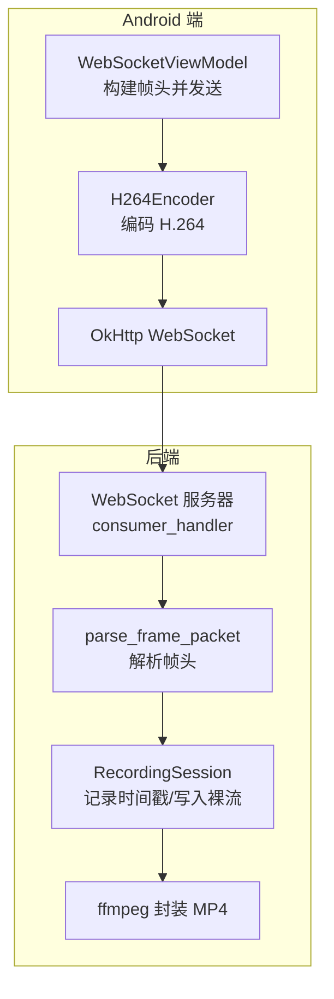
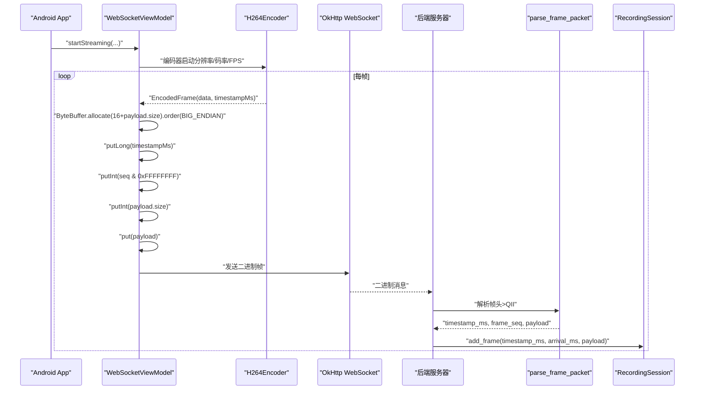
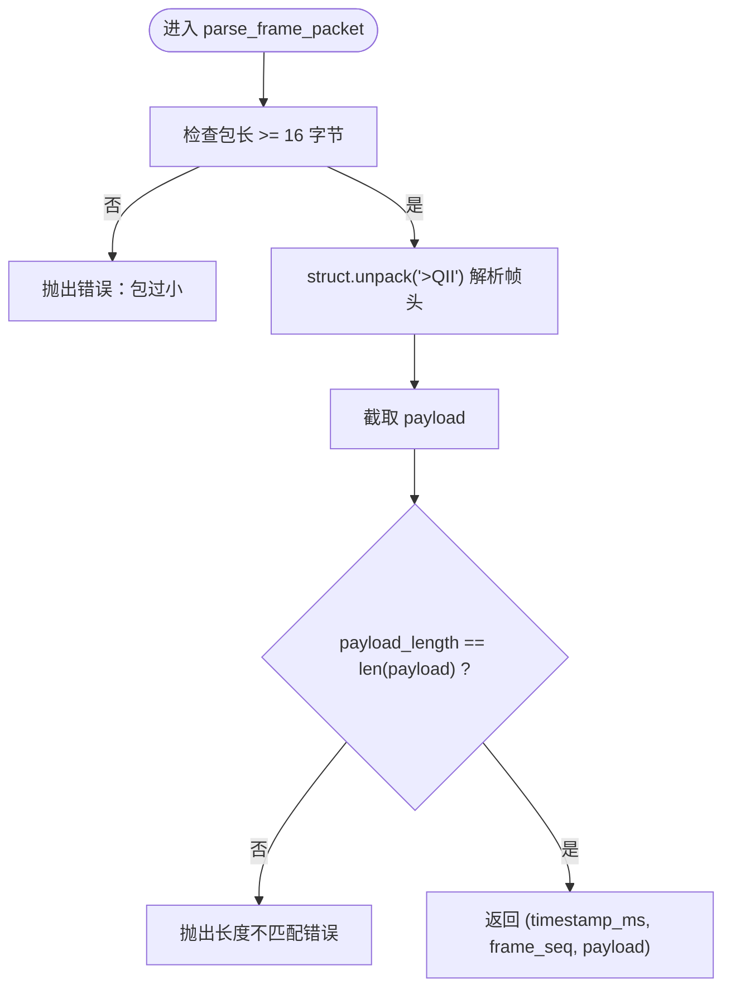
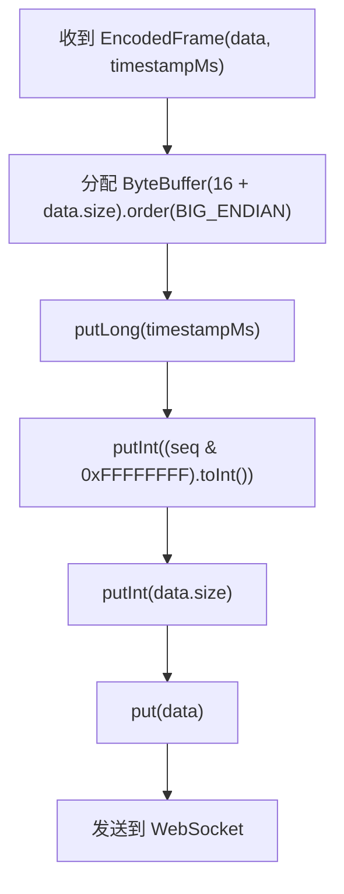
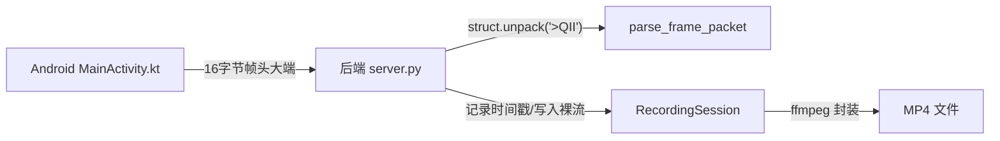

# 帧头协议

<cite>
**本文档引用的文件**
- [server.py](file://backend/server.py)
- [README.md（后端）](file://backend/README.md)
- [MainActivity.kt](file://android-camera/app/src/main/java/com/example/lablogcamera/MainActivity.kt)
- [README.md（Android 摄像头项目）](file://android-camera/README.md)
</cite>

## 目录
1. [简介](#简介)
2. [项目结构](#项目结构)
3. [核心组件](#核心组件)
4. [架构总览](#架构总览)
5. [详细组件分析](#详细组件分析)
6. [依赖关系分析](#依赖关系分析)
7. [性能考量](#性能考量)
8. [故障排查指南](#故障排查指南)
9. [结论](#结论)

## 简介
本文件系统化文档化了 H.264 视频流的自定义帧头协议，明确 16 字节帧头的二进制布局与大小端约定，并给出 Python struct 与 Kotlin ByteBuffer 的序列化/反序列化路径指引。文档还解释了该协议在 Android 的 H264Encoder 与后端 parse_frame_packet 之间的严格对应关系，以及后端如何利用设备时间戳与服务器到达时间戳进行 FPS 估算，最后强调协议的字节序与大小端一致性要求，避免跨平台问题。

## 项目结构
- 后端（Python）：WebSocket 服务器，负责接收二进制帧（含自定义 16 字节帧头 + H.264 裸码流），解析帧头，记录时间戳，估算 FPS，并在录制结束时封装为 MP4。
- Android 端（Kotlin）：使用 CameraX + MediaCodec 采集与编码 H.264，通过 WebSocket 发送二进制帧，帧头为 16 字节自定义结构，包含设备时间戳、帧序号与负载长度。

图表来源
- [server.py](file://backend/server.py#L233-L303)
- [server.py](file://backend/server.py#L135-L147)
- [MainActivity.kt](file://android-camera/app/src/main/java/com/example/lablogcamera/MainActivity.kt#L967-L984)

章节来源
- [server.py](file://backend/server.py#L233-L303)
- [README.md（后端）](file://backend/README.md#L36-L115)
- [README.md（Android 摄像头项目）](file://android-camera/README.md#L253-L269)

## 核心组件
- 自定义帧头格式与大小端
  - 前 8 字节：大端序 uint64 设备时间戳（毫秒）
  - 中间 4 字节：大端序 uint32 帧序号（低 32 位循环递增）
  - 后 4 字节：大端序 uint32 H.264 负载长度（字节数）
  - 总长度：16 字节
- 后端解析
  - 使用 struct 以大端解析帧头，截取后续负载并校验长度
  - 记录首尾设备时间戳与服务器到达时间戳，用于 FPS 估算
- Android 序列化
  - 使用 ByteBuffer 以大端序写入 16 字节帧头，随后紧跟 H.264 裸码流
  - 帧序号为低 32 位循环递增（高 32 位在 64 位整型中按掩码循环）

章节来源
- [README.md（后端）](file://backend/README.md#L36-L62)
- [server.py](file://backend/server.py#L135-L147)
- [MainActivity.kt](file://android-camera/app/src/main/java/com/example/lablogcamera/MainActivity.kt#L967-L984)

## 架构总览
下面的时序图展示了 Android 与后端在帧头协议上的严格对应关系：Android 侧构造 16 字节帧头（大端），后端侧以相同格式解析，二者在字节序与字段语义上完全一致。

图表来源
- [MainActivity.kt](file://android-camera/app/src/main/java/com/example/lablogcamera/MainActivity.kt#L967-L984)
- [server.py](file://backend/server.py#L135-L147)
- [server.py](file://backend/server.py#L233-L303)

## 详细组件分析

### 后端解析：parse_frame_packet
- 功能要点
  - 校验包长至少包含 16 字节帧头
  - 使用大端格式解析：uint64 设备时间戳、uint32 帧序号、uint32 负载长度
  - 截取后续负载并校验长度一致性
  - 返回三元组：timestamp_ms、frame_seq、payload
- FPS 估算
  - 录制会话记录首尾设备时间戳与服务器到达时间戳
  - 优先使用“服务器到达时间”估算，若不可信则回退到“设备时间戳”
  - 两者均不可用时使用保底 10 FPS

图表来源
- [server.py](file://backend/server.py#L135-L147)

章节来源
- [server.py](file://backend/server.py#L135-L147)
- [README.md（后端）](file://backend/README.md#L36-L62)

### Android 序列化：帧头构造
- 功能要点
  - 以大端序 ByteBuffer 构造 16 字节帧头
  - 字段顺序与大小端与后端解析一致
  - 帧序号为低 32 位循环递增（通过掩码保持 32 位循环）
  - 发送时先写入帧头，再写入 H.264 裸码流

图表来源
- [MainActivity.kt](file://android-camera/app/src/main/java/com/example/lablogcamera/MainActivity.kt#L967-L984)

章节来源
- [MainActivity.kt](file://android-camera/app/src/main/java/com/example/lablogcamera/MainActivity.kt#L967-L984)
- [README.md（Android 摄像头项目）](file://android-camera/README.md#L253-L269)

### 字节序与大小端一致性
- 帧头字段严格采用大端序（>QII，BIG_ENDIAN）
- Android 侧 ByteBuffer 显式设置为大端序
- 后端侧 struct 以大端格式解析
- 任何一方使用错误字节序将导致解析失败或数据错乱

章节来源
- [README.md（后端）](file://backend/README.md#L36-L62)
- [MainActivity.kt](file://android-camera/app/src/main/java/com/example/lablogcamera/MainActivity.kt#L967-L984)

### FPS 估算与数据完整性校验
- FPS 估算
  - 服务器记录首尾设备时间戳与服务器到达时间戳
  - 优先使用“服务器到达时间”估算，要求 > 1.5fps 才认为可信
  - 否则回退到“设备时间戳”估算
  - 两者均不可用时使用保底 10 FPS
- 数据完整性校验
  - 后端解析时校验 payload_length 与实际负载长度一致
  - 帧序号可用于检测丢包或乱序（结合业务逻辑可进一步实现）
  - 服务器端记录首尾时间戳，用于事后统计与可视化

章节来源
- [server.py](file://backend/server.py#L80-L133)
- [server.py](file://backend/server.py#L135-L147)

## 依赖关系分析
- Android 与后端的协议耦合点
  - 帧头字段顺序与大小端完全一致
  - 负载长度字段用于校验
  - 时间戳用于时间轴重建与 FPS 估算
- 外部依赖
  - 后端：websockets（WebSocket）、ffmpeg（封装 MP4）
  - Android：OkHttp WebSocket、MediaCodec（H.264 编码）

图表来源
- [MainActivity.kt](file://android-camera/app/src/main/java/com/example/lablogcamera/MainActivity.kt#L967-L984)
- [server.py](file://backend/server.py#L135-L147)
- [server.py](file://backend/server.py#L233-L303)

章节来源
- [README.md（后端）](file://backend/README.md#L1-L35)
- [README.md（Android 摄像头项目）](file://android-camera/README.md#L1-L40)

## 性能考量
- 传输效率
  - 帧头仅 16 字节，开销极低
  - 负载长度字段可避免不必要的解析与内存拷贝
- 解析性能
  - 后端使用 struct 以大端解析，解析成本低
  - 录制会话仅记录必要时间戳，避免冗余存储
- 封装性能
  - 使用 ffmpeg -c:v copy 直接封装，无重编码，速度快且无损

章节来源
- [README.md（后端）](file://backend/README.md#L89-L115)
- [server.py](file://backend/server.py#L150-L179)

## 故障排查指南
- 常见错误与定位
  - 帧包过小：后端抛出“包过小，无法包含帧头”
  - 负载长度不匹配：后端抛出“payload 长度不一致”
  - 字节序错误：Android 与后端任一方使用错误字节序将导致解析异常
- 建议排查步骤
  - 确认 Android 侧 ByteBuffer 为大端序
  - 确认后端 struct 使用大端格式解析
  - 校验 payload_length 与实际负载长度一致
  - 检查帧序号是否按低 32 位循环递增
  - 检查服务器端 ffmpeg 是否可用，环境变量 FFMPEG_BIN 是否正确

章节来源
- [server.py](file://backend/server.py#L135-L147)
- [README.md（后端）](file://backend/README.md#L1-L35)

## 结论
该自定义帧头协议以极小开销实现了跨平台的 H.264 帧传输与时间戳重建。Android 与后端在帧头字段顺序、大小端与长度校验上保持严格一致，确保了协议的健壮性与可移植性。后端利用设备时间戳与服务器到达时间戳进行 FPS 估算，并通过 ffmpeg 直接封装生成 MP4，整体链路高效可靠。遵循本文档的字节序与大小端约定，可有效避免跨平台问题。