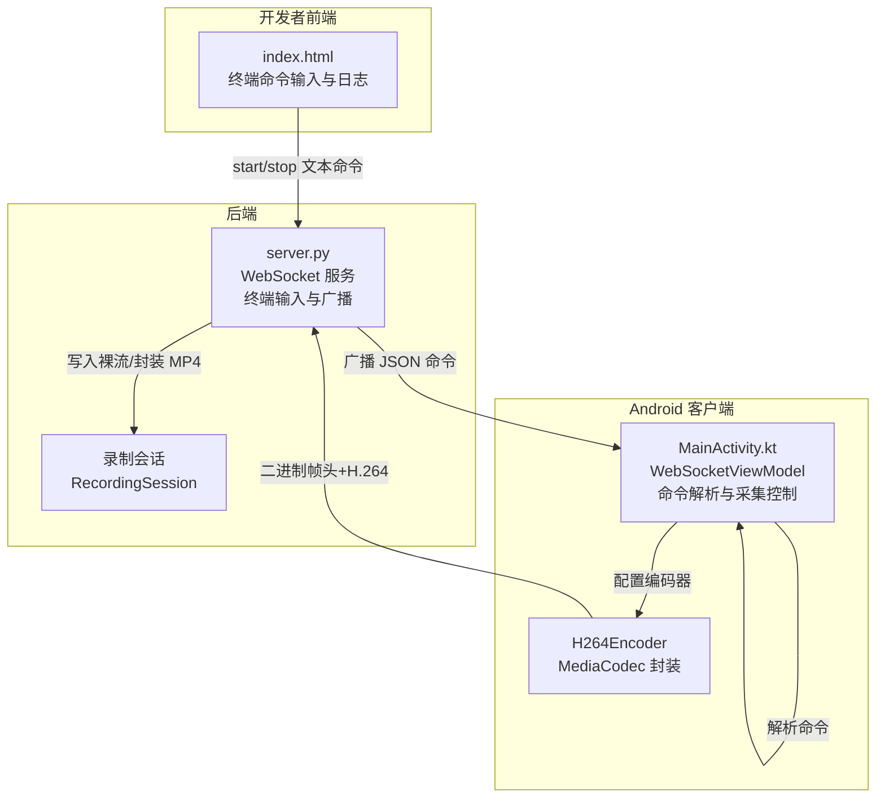
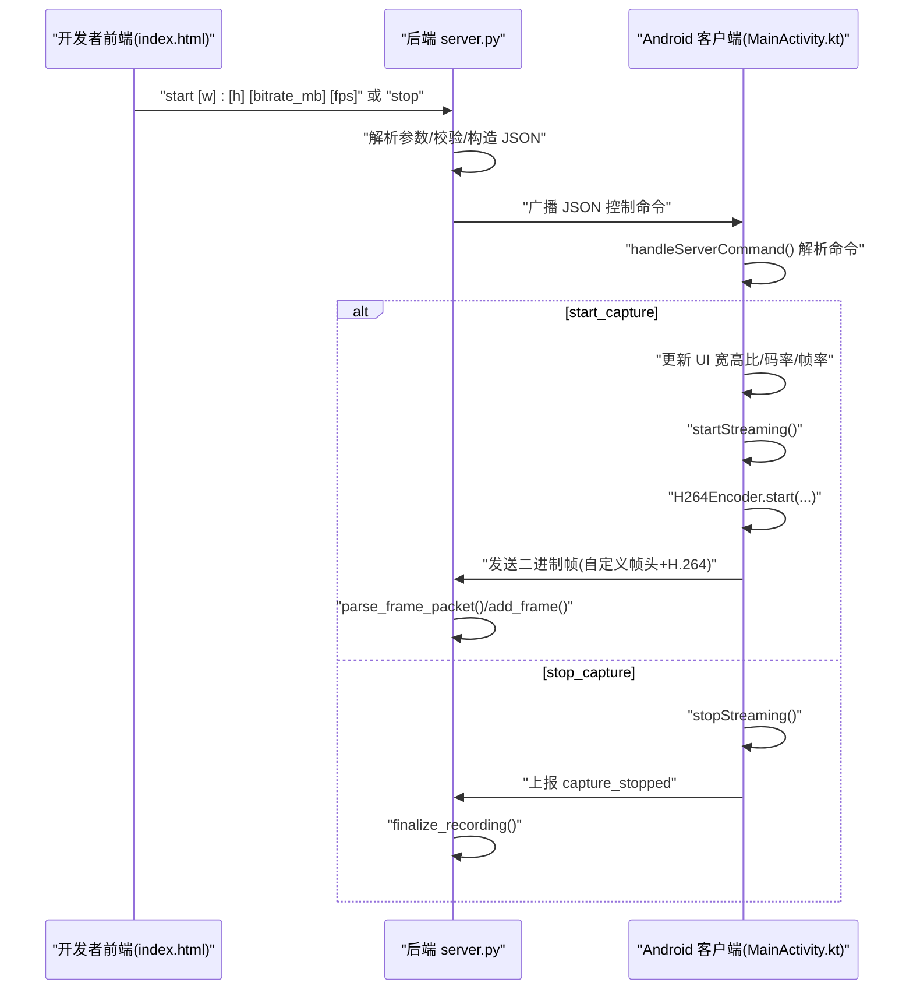
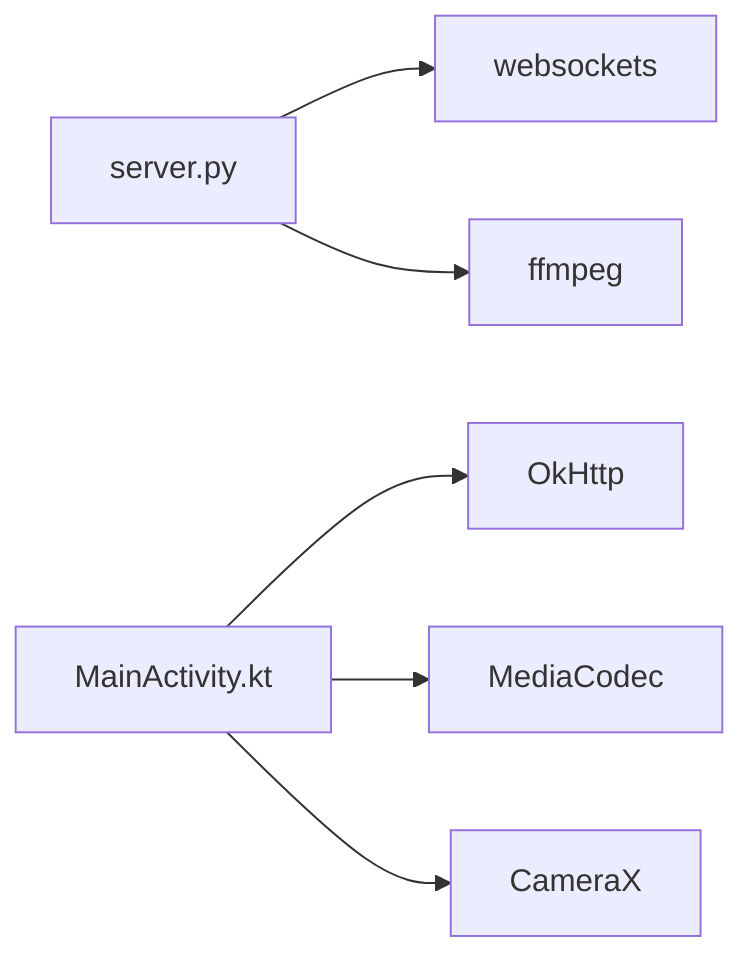

# 控制命令

<cite>
**本文引用的文件**
- [server.py](file://backend/server.py)
- [README.md](file://backend/README.md)
- [MainActivity.kt](file://android-camera/app/src/main/java/com/example/lablogcamera/MainActivity.kt)
- [index.html](file://developer-frontend/index.html)
</cite>

## 目录
1. [简介](#简介)
2. [项目结构](#项目结构)
3. [核心组件](#核心组件)
4. [架构总览](#架构总览)
5. [详细组件分析](#详细组件分析)
6. [依赖关系分析](#依赖关系分析)
7. [性能考量](#性能考量)
8. [故障排查指南](#故障排查指南)
9. [结论](#结论)

## 简介
本文件面向 lab-log 项目的 WebSocket 控制命令，聚焦 start_capture 与 stop_capture 两类命令的 JSON 文本消息格式与处理流程，涵盖：
- start_capture 命令的 payload 结构与字段语义（format、aspectRatio、bitrate、fps）
- 服务器端命令解析与广播策略
- 客户端（Android App）对命令的解析、状态变更与编码器配置
- 服务器发送“纯 start”命令时的默认行为与客户端回退策略
- 错误处理与参数校验策略
- 客户端实现指引（如何在收到命令后触发状态变更与编码器配置）

## 项目结构
- 后端服务器：负责接收 Android App 的二进制帧与文本状态，同时在终端输入 start/stop 命令并通过广播下发控制命令。
- Android 客户端：解析服务器下发的控制命令，更新 UI 与采集参数，驱动编码器发送 H.264 帧。
- 开发者前端：用于连接后端终端，输入 start/stop 命令并观察日志。

图表来源
- [server.py](file://backend/server.py#L305-L416)
- [MainActivity.kt](file://android-camera/app/src/main/java/com/example/lablogcamera/MainActivity.kt#L867-L942)
- [index.html](file://developer-frontend/index.html#L527-L566)

章节来源
- [server.py](file://backend/server.py#L305-L416)
- [README.md](file://backend/README.md#L160-L214)
- [MainActivity.kt](file://android-camera/app/src/main/java/com/example/lablogcamera/MainActivity.kt#L867-L942)
- [index.html](file://developer-frontend/index.html#L527-L566)

## 核心组件
- 服务器命令解析与广播
  - 终端输入 start/stop，解析参数并构造 JSON 控制命令，广播给所有已连接客户端。
  - start 命令可携带宽高比、码率（MB）、目标帧率（fps），若未携带宽高比，则客户端使用当前 UI 选择的宽高比。
- 客户端命令解析与状态变更
  - 解析 start_capture/stop_capture 命令，更新 UI 状态、选择的宽高比、目标码率与帧率。
  - 根据命令参数启动/停止编码器与帧发送流程，并上报状态。
- 录制会话与帧头约定
  - 服务器记录每个会话的帧头（设备时间戳、帧序号、负载长度），并据此估算 FPS 与封装 MP4。

章节来源
- [server.py](file://backend/server.py#L326-L416)
- [MainActivity.kt](file://android-camera/app/src/main/java/com/example/lablogcamera/MainActivity.kt#L867-L942)
- [README.md](file://backend/README.md#L36-L114)

## 架构总览
下图展示了从服务器终端输入命令到客户端执行控制的端到端流程。

图表来源
- [server.py](file://backend/server.py#L326-L416)
- [MainActivity.kt](file://android-camera/app/src/main/java/com/example/lablogcamera/MainActivity.kt#L867-L942)
- [README.md](file://backend/README.md#L115-L157)

## 详细组件分析

### 文本消息 JSON 格式：start_capture 与 stop_capture
- start_capture
  - 结构
    - command: "start_capture"
    - payload: 对象，包含以下字段
      - format: "h264"
      - aspectRatio: 对象（可选），包含 width、height（均为正整数）
      - bitrate: 整数（MB），客户端会将其转换为 bps
      - fps: 整数（帧/秒），0 或省略表示不限帧率
  - 服务器端参数解析与默认值
    - 宽高比：若命令行提供了 [w]:[h]，则 payload 中包含 aspectRatio；否则不包含该字段，客户端使用当前 UI 选择的宽高比。
    - 码率：默认 4 MB；非法或非正数时回退为 4 MB。
    - 帧率：默认 10；非法或负数时回退为 10；0 表示不限帧率。
- stop_capture
  - 结构
    - command: "stop_capture"
  - 客户端行为
    - 停止编码器与帧发送，上报 capture_stopped，服务器据此结束会话并封装 MP4。

章节来源
- [server.py](file://backend/server.py#L355-L416)
- [README.md](file://backend/README.md#L170-L214)
- [MainActivity.kt](file://android-camera/app/src/main/java/com/example/lablogcamera/MainActivity.kt#L902-L942)

### 服务器端命令解析与广播
- 终端输入处理
  - start 命令解析：支持可选的宽高比、码率（MB）、帧率（fps）参数；参数缺失时采用默认值。
  - stop 命令解析：构造 stop_capture JSON 并广播。
- 广播机制
  - 使用 asyncio.gather 并行广播，记录发送失败的客户端。

章节来源
- [server.py](file://backend/server.py#L326-L416)

### 客户端命令解析与状态变更
- 命令解析
  - onMessage 接收文本消息，调用 handleServerCommand 解析 JSON。
  - start_capture
    - 若 payload 含 aspectRatio：覆盖 UI 选择的宽高比，并同步到 UI。
    - 若 payload 缺失 aspectRatio：使用当前 UI 选择的宽高比。
    - 将 bitrate（MB）转换为 bps，记录 requestedFps（0 表示不限帧率）。
    - 调用 startStreaming。
  - stop_capture：调用 stopStreaming。
- 状态上报
  - startStreaming 成功后上报 capture_started；stopStreaming 后上报 capture_stopped。

章节来源
- [MainActivity.kt](file://android-camera/app/src/main/java/com/example/lablogcamera/MainActivity.kt#L867-L942)
- [MainActivity.kt](file://android-camera/app/src/main/java/com/example/lablogcamera/MainActivity.kt#L1203-L1226)

### 客户端编码器配置与帧发送
- startStreaming
  - 计算示例分辨率（用于日志与 UI 展示），记录 requestedAspectRatio、requestedWidth、requestedHeight、requestedFps。
  - 初始化 H264Encoder，设置编码器参数（分辨率、码率 bps、目标帧率）。
  - ImageAnalysis 使用设备支持的最大分辨率，按服务器指定宽高比进行裁剪与旋转，随后编码并发送二进制帧。
  - 帧头格式（大端）：8 字节设备时间戳（毫秒）、4 字节帧序号（低 32 位）、4 字节负载长度、N 字节 H.264 裸码流。
- stopStreaming
  - 清理 ImageAnalysis、停止编码器、清除裁剪锁定、复位状态并上报 capture_stopped。

章节来源
- [MainActivity.kt](file://android-camera/app/src/main/java/com/example/lablogcamera/MainActivity.kt#L944-L1200)
- [README.md](file://backend/README.md#L36-L60)

### 服务器端帧头解析与会话管理
- 帧头解析
  - parse_frame_packet：校验帧头长度与负载长度，返回设备时间戳、帧序号与 H.264 裸码流。
- 会话管理
  - RecordingSession：记录首尾帧时间戳，估算 FPS，最终封装为 MP4。
  - consumer_handler：文本消息解析 App 状态（capture_started/capture_stopped），二进制消息写入会话。

章节来源
- [README.md](file://backend/README.md#L36-L114)
- [server.py](file://backend/server.py#L135-L179)
- [server.py](file://backend/server.py#L210-L231)

### 宽高比与帧率的默认回退策略
- 服务器端
  - 宽高比：未提供时，不下发 aspectRatio 字段，客户端使用当前 UI 选择的宽高比。
  - 码率：非法或非正数时回退为 4 MB。
  - 帧率：非法或负数时回退为 10；0 表示不限帧率。
- 客户端端
  - 若服务器下发了 aspectRatio：覆盖 UI 选择；否则使用 UI 选择。
  - 若服务器下发了 fps：按目标帧率主动丢帧；否则不限帧率。

章节来源
- [server.py](file://backend/server.py#L355-L416)
- [MainActivity.kt](file://android-camera/app/src/main/java/com/example/lablogcamera/MainActivity.kt#L902-L942)
- [MainActivity.kt](file://android-camera/app/src/main/java/com/example/lablogcamera/MainActivity.kt#L1329-L1341)

### 客户端实现指南（如何在收到命令后触发状态变更与编码器配置）
- 接收命令
  - 在 WebSocketListener 的 onMessage 中调用 handleServerCommand。
- 解析与回退
  - 解析 payload：format、aspectRatio、bitrate、fps。
  - 若未提供 aspectRatio：使用当前 UI 选择的宽高比。
  - 若未提供 fps：不限帧率；若为 0：不限帧率。
- 启动采集
  - startStreaming：设置 requestedAspectRatio/requestedWidth/requestedHeight/requestedFps，初始化 H264Encoder，绑定 ImageAnalysis，按目标帧率丢帧并发送帧。
- 停止采集
  - stopStreaming：清理资源并上报 capture_stopped。

章节来源
- [MainActivity.kt](file://android-camera/app/src/main/java/com/example/lablogcamera/MainActivity.kt#L867-L942)
- [MainActivity.kt](file://android-camera/app/src/main/java/com/example/lablogcamera/MainActivity.kt#L944-L1200)

## 依赖关系分析
- 服务器端
  - 终端输入与广播依赖 asyncio/websockets；帧头解析依赖 struct；封装 MP4 依赖 ffmpeg。
- 客户端
  - WebSocket 依赖 OkHttp；编码器依赖 MediaCodec；UI 与相机控制依赖 CameraX。

图表来源
- [server.py](file://backend/server.py#L1-L20)
- [README.md](file://backend/README.md#L278-L291)
- [MainActivity.kt](file://android-camera/app/src/main/java/com/example/lablogcamera/MainActivity.kt#L1-L120)

## 性能考量
- 帧率控制
  - 客户端通过 shouldSendFrame 按目标帧率主动丢帧，避免网络拥塞与设备过载。
- 编码器参数
  - 客户端将 MB 转换为 bps 传入 MediaFormat.KEY_BIT_RATE；帧率 KEY_FRAME_RATE 作为参考。
- 服务器封装
  - 使用 -c:v copy 直接封装，避免重编码；显式指定 -r <fps>，提升时间轴准确性。

章节来源
- [MainActivity.kt](file://android-camera/app/src/main/java/com/example/lablogcamera/MainActivity.kt#L1329-L1341)
- [README.md](file://backend/README.md#L90-L114)

## 故障排查指南
- 无效参数
  - 服务器端：宽高比非正数、码率非正数、帧率负数时均回退到默认值，并打印错误提示。
  - 客户端端：解析异常时记录日志并上报 error 状态。
- 连接与断开
  - 客户端 onClosed/onFailure 中会停止采集并清空状态。
- 帧头与负载不匹配
  - 服务器端 parse_frame_packet 会校验负载长度，不匹配时记录错误并忽略该帧。

章节来源
- [server.py](file://backend/server.py#L135-L147)
- [server.py](file://backend/server.py#L355-L416)
- [MainActivity.kt](file://android-camera/app/src/main/java/com/example/lablogcamera/MainActivity.kt#L867-L942)

## 结论
- start_capture 命令的 payload 仅支持 format="h264"，可选包含 aspectRatio、bitrate（MB）、fps。
- 服务器端对参数进行严格校验与默认回退；当服务器发送“纯 start”命令时不包含 aspectRatio 时，客户端使用当前 UI 选择的宽高比。
- 客户端在收到命令后，应更新 UI 与采集参数，启动编码器并按目标帧率发送帧；停止命令则清理资源并上报状态。
- 服务器端负责解析帧头、统计时间戳、估算 FPS 并封装 MP4，确保时间轴准确与无重编码开销。