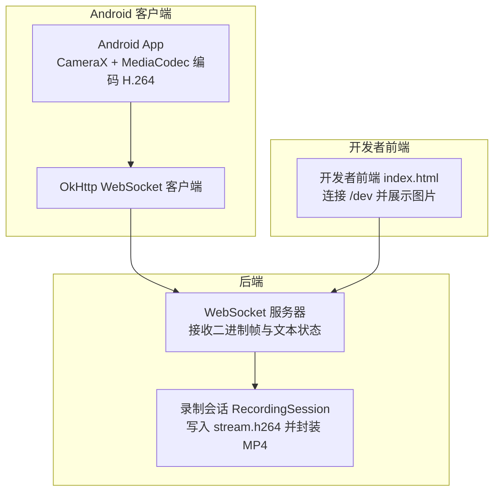
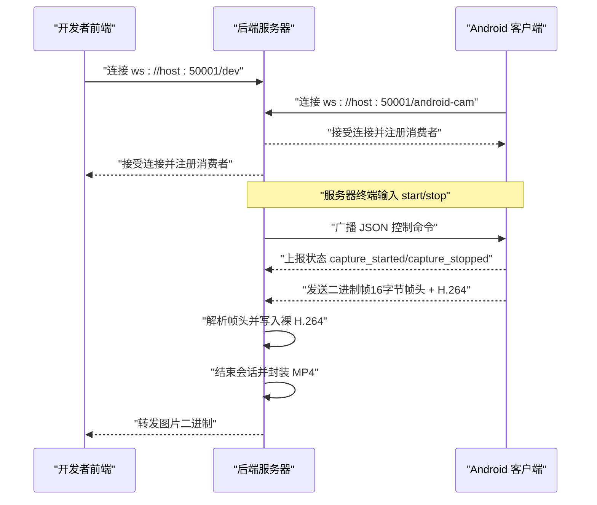
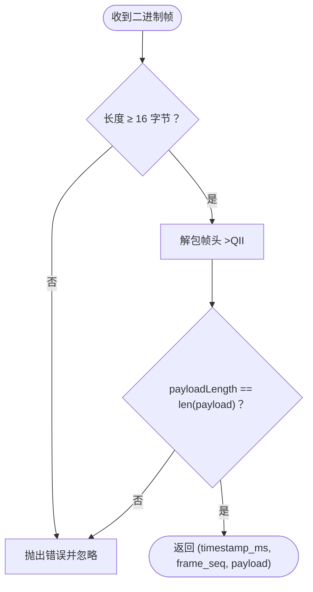
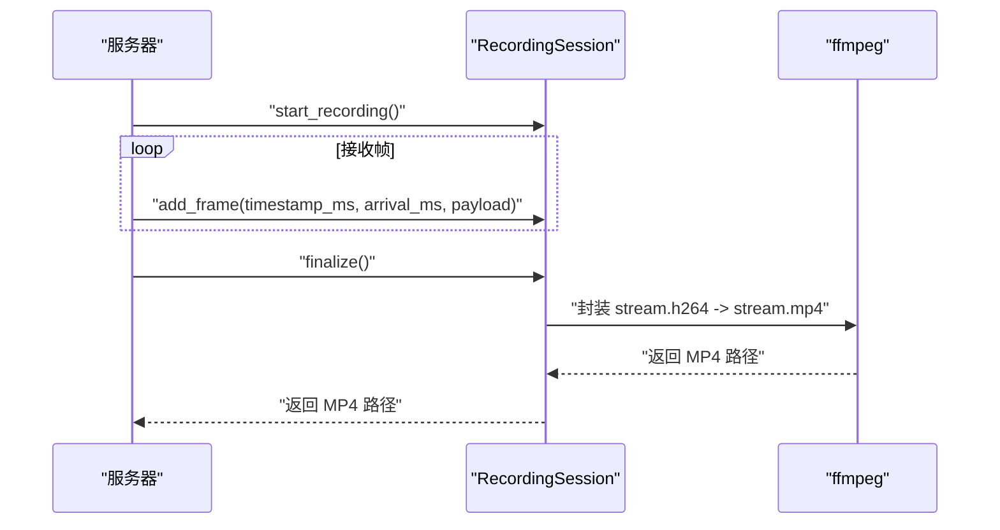
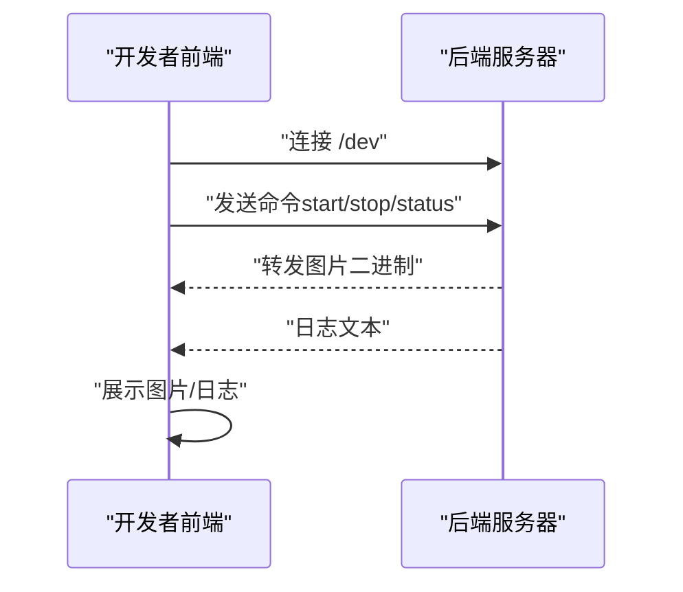
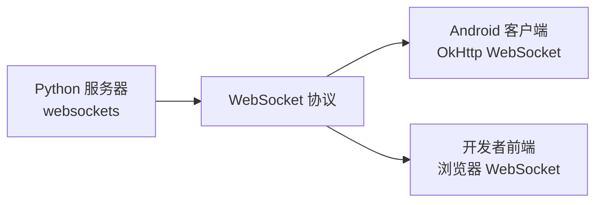

# 通信协议

<cite>
**本文引用的文件**
- [backend/server.py](file://backend/server.py)
- [backend/README.md](file://backend/README.md)
- [android-camera/README.md](file://android-camera/README.md)
- [developer-frontend/index.html](file://developer-frontend/index.html)
- [archive/20251117_arduino_send_images_to_backend_and_frontend/backend/server.py](file://archive/20251117_arduino_send_images_to_backend_and_frontend/backend/server.py)
- [archive/20251117_arduino_send_images_to_backend_and_frontend/developer-frontend/index.html](file://archive/20251117_arduino_send_images_to_backend_and_frontend/developer-frontend/index.html)
</cite>

## 目录
1. [简介](#简介)
2. [项目结构](#项目结构)
3. [核心组件](#核心组件)
4. [架构总览](#架构总览)
5. [详细组件分析](#详细组件分析)
6. [依赖分析](#依赖分析)
7. [性能考量](#性能考量)
8. [故障排查指南](#故障排查指南)
9. [结论](#结论)
10. [附录](#附录)

## 简介
本文件为 lab-log 项目的 WebSocket 通信协议文档，聚焦于 Android 相机推流场景。内容涵盖：
- 连接处理与生命周期
- 文本消息（JSON 控制命令与状态）与二进制消息（带 16 字节帧头的 H.264 视频帧）格式
- 帧头结构（8 字节时间戳、4 字节帧序号、4 字节负载长度）
- 协议示例、错误处理策略与安全考虑
- 客户端实现指导与开发者前端交互说明

## 项目结构
该项目包含后端 WebSocket 服务器、Android 相机客户端以及开发者前端。后端负责接收 H.264 帧并封装为 MP4；Android 客户端负责采集、编码并通过 WebSocket 推流；开发者前端用于连接与调试。



图表来源
- [backend/server.py](file://backend/server.py#L210-L303)
- [android-camera/README.md](file://android-camera/README.md#L135-L269)
- [developer-frontend/index.html](file://developer-frontend/index.html#L347-L451)

章节来源
- [backend/server.py](file://backend/server.py#L210-L303)
- [backend/README.md](file://backend/README.md#L1-L60)

## 核心组件
- WebSocket 服务器：监听端口，处理连接、广播控制命令、接收二进制帧与文本状态、管理录制会话。
- 录制会话 RecordingSession：按客户端与时间戳创建独立目录，写入裸 H.264，结束时封装为 MP4 并生成缩略图。
- 帧头解析：严格解析 16 字节帧头（时间戳、帧序号、负载长度），并校验负载长度一致性。
- 终端控制：从服务器终端输入 start/stop 命令，广播 JSON 控制命令给所有已连接客户端。

章节来源
- [backend/server.py](file://backend/server.py#L26-L133)
- [backend/server.py](file://backend/server.py#L135-L179)
- [backend/server.py](file://backend/server.py#L210-L303)
- [backend/README.md](file://backend/README.md#L160-L215)

## 架构总览
后端服务器通过 websockets 库提供 WebSocket 服务，Android 客户端通过 OkHttp WebSocket 连接后端，开发者前端通过浏览器连接后端的 /dev 端点进行调试与查看图片。



图表来源
- [backend/server.py](file://backend/server.py#L210-L303)
- [backend/server.py](file://backend/server.py#L305-L324)
- [backend/server.py](file://backend/server.py#L326-L423)
- [android-camera/README.md](file://android-camera/README.md#L135-L269)
- [developer-frontend/index.html](file://developer-frontend/index.html#L347-L451)

## 详细组件分析

### 1) 连接处理与生命周期
- 连接入口：connection_handler 为每个新连接计算 client_id，记录请求路径，并将连接加入全局集合 CONNECTED_CLIENTS。
- 消费者处理：consumer_handler 负责区分文本消息与二进制消息，分别处理状态上报与帧数据。
- 会话管理：start_recording 与 finalize_recording 在状态上报时创建/结束录制会话。
- 终端控制：terminal_input_handler 从服务器终端读取 start/stop 命令，构造 JSON 广播给所有客户端。

```mermaid
flowchart TD
Start(["连接建立"]) --> Register["加入 CONNECTED_CLIENTS"]
Register --> Consumer["进入 consumer_handler"]
Consumer --> MsgType{"消息类型？"}
MsgType --> |文本(JSON)| Status["解析状态字段<br/>capture_started/capture_stopped"]
MsgType --> |二进制(H.264帧)| Frame["解析帧头<br/>校验负载长度"]
Status --> Session{"是否存在会话？"}
Session --> |是| Add["写入裸 H.264"]
Session --> |否| Warn["忽略或记录告警"]
Frame --> Parse["解析时间戳/序号/长度"]
Parse --> Write["写入裸 H.264"]
Add --> End
Write --> End
Warn --> End
End(["连接关闭/断开"]) --> Finalize["结束会话并封装 MP4"]
```

图表来源
- [backend/server.py](file://backend/server.py#L210-L303)
- [backend/server.py](file://backend/server.py#L233-L279)
- [backend/server.py](file://backend/server.py#L326-L423)

章节来源
- [backend/server.py](file://backend/server.py#L210-L303)
- [backend/server.py](file://backend/server.py#L326-L423)

### 2) 文本消息：JSON 控制命令与状态
- 控制命令（服务器 → 客户端）：
  - start_capture：包含 format、bitrate、fps，可选 aspectRatio。
  - stop_capture：停止推流。
- 状态上报（客户端 → 服务器）：
  - ready/capture_started/capture_stopped 等状态对象。
- 服务器终端输入 start/stop 会广播对应 JSON 控制命令。

章节来源
- [backend/README.md](file://backend/README.md#L160-L215)
- [android-camera/README.md](file://android-camera/README.md#L173-L249)

### 3) 二进制消息：带 16 字节帧头的 H.264 帧
- 帧头结构（大端）：
  - 8 字节：设备时间戳（毫秒）
  - 4 字节：帧序号（低 32 位递增）
  - 4 字节：后续 H.264 负载长度（字节数）
- 负载：H.264 NAL 裸码流
- 服务器解析流程：
  - 校验包长度 ≥ 16 字节
  - 按 >QII 解包得到时间戳、帧序号、负载长度
  - 截取负载并校验长度一致性
  - 返回 (timestamp_ms, frame_seq, payload)



图表来源
- [backend/server.py](file://backend/server.py#L135-L147)
- [backend/README.md](file://backend/README.md#L36-L60)

章节来源
- [backend/server.py](file://backend/server.py#L135-L147)
- [backend/README.md](file://backend/README.md#L36-L60)

### 4) 录制会话与封装
- 会话创建：收到 capture_started 状态后创建 RecordingSession，按 client_id+时间戳创建独立目录，打开 stream.h264。
- 帧写入：add_frame 追加写入裸 H.264，并记录首尾设备时间戳与服务器到达时间。
- 结束与封装：finalize 关闭文件，估算 FPS，调用 ffmpeg 将 stream.h264 封装为 stream.mp4，并提取第一帧为缩略图。
- FPS 估算：优先使用服务器到达时间估算，其次使用设备时间戳，最后回退到 10 FPS。



图表来源
- [backend/server.py](file://backend/server.py#L26-L133)
- [backend/server.py](file://backend/server.py#L150-L179)
- [backend/server.py](file://backend/server.py#L181-L207)

章节来源
- [backend/server.py](file://backend/server.py#L26-L133)
- [backend/server.py](file://backend/server.py#L150-L207)

### 5) 开发者前端与交互
- 连接 /dev：前端通过 WebSocket 连接到 ws://host:50001/dev。
- 发送命令：支持 start/stop/status 与自定义字符串命令。
- 接收图片：二进制数据作为 JPEG 展示，文本消息作为日志显示。
- 全屏与双击切换：支持全屏查看图片。



图表来源
- [developer-frontend/index.html](file://developer-frontend/index.html#L347-L451)
- [archive/20251117_arduino_send_images_to_backend_and_frontend/developer-frontend/index.html](file://archive/20251117_arduino_send_images_to_backend_and_frontend/developer-frontend/index.html#L347-L451)

章节来源
- [developer-frontend/index.html](file://developer-frontend/index.html#L347-L451)

### 6) 协议示例与最佳实践
- 控制命令示例（服务器 → 客户端）：
  - start_capture：包含 format、bitrate、fps，可选 aspectRatio。
  - stop_capture：停止推流。
- 状态上报示例（客户端 → 服务器）：
  - ready/capture_started/capture_stopped。
- 帧头示例（二进制）：
  - 16 字节帧头 + H.264 裸码流。
- 最佳实践：
  - 严格校验帧头长度与负载长度一致性。
  - 使用服务器到达时间估算 FPS，必要时回退到设备时间戳。
  - ffmpeg 封装时显式指定帧率，避免错误推断。

章节来源
- [backend/README.md](file://backend/README.md#L160-L215)
- [android-camera/README.md](file://android-camera/README.md#L173-L249)
- [backend/server.py](file://backend/server.py#L135-L147)

## 依赖分析
- 后端依赖：websockets、struct、subprocess、pathlib、datetime 等。
- Android 客户端依赖：CameraX、MediaCodec、OkHttp WebSocket。
- 开发者前端：浏览器原生 WebSocket API。



图表来源
- [backend/server.py](file://backend/server.py#L1-L20)
- [android-camera/README.md](file://android-camera/README.md#L135-L269)
- [developer-frontend/index.html](file://developer-frontend/index.html#L347-L451)

章节来源
- [backend/server.py](file://backend/server.py#L1-L20)
- [android-camera/README.md](file://android-camera/README.md#L135-L269)

## 性能考量
- 帧率估算：优先使用服务器到达时间估算，若不可信则回退到设备时间戳，最后使用 10 FPS 保底。
- 封装效率：ffmpeg 直接拷贝视频轨（-c:v copy），避免重编码，速度快且无损。
- 客户端旋转：在 Android 端完成旋转，后端无需再次旋转，降低服务器负载。
- 帧头解析：使用 struct 以大端解析，避免不必要的转换开销。

章节来源
- [backend/server.py](file://backend/server.py#L80-L133)
- [backend/server.py](file://backend/server.py#L150-L179)
- [android-camera/README.md](file://android-camera/README.md#L404-L418)

## 故障排查指南
- 连接问题：
  - 检查服务器监听地址与端口（默认 50001）。
  - 确认客户端 URL 与后端路径匹配（/android-cam 或 /dev）。
- 帧头解析错误：
  - 包长度小于 16 字节或负载长度与实际不符。
  - 检查客户端帧头构造是否为大端格式。
- 录制未生成 MP4：
  - ffmpeg 未安装或不可执行，或封装失败（查看 stderr）。
  - 会话未结束（未上报 capture_stopped 或连接断开）。
- 终端命令无效：
  - 仅支持 start/stop，参数格式错误会回退到默认值。
  - 无已连接客户端时广播会失败。

章节来源
- [backend/server.py](file://backend/server.py#L135-L147)
- [backend/server.py](file://backend/server.py#L150-L179)
- [backend/server.py](file://backend/server.py#L305-L324)
- [backend/server.py](file://backend/server.py#L326-L423)

## 结论
lab-log 的 WebSocket 协议围绕“文本控制命令 + 二进制帧头 + H.264 裸码流”展开，具备明确的帧头结构与严格的解析流程。后端通过会话管理与 ffmpeg 封装实现了高效稳定的录制与交付。Android 客户端在客户端完成旋转与裁剪，进一步优化了后端处理效率。开发者前端可用于快速联调与查看图片。

## 附录
- 端点说明：
  - /android-cam：Android 相机客户端连接
  - /dev：开发者前端连接
- 安全建议：
  - 在生产环境中启用 TLS/WS-Secure 与认证机制。
  - 限制连接来源与速率，防止滥用。
  - 对输入命令与帧头进行严格校验与限流。