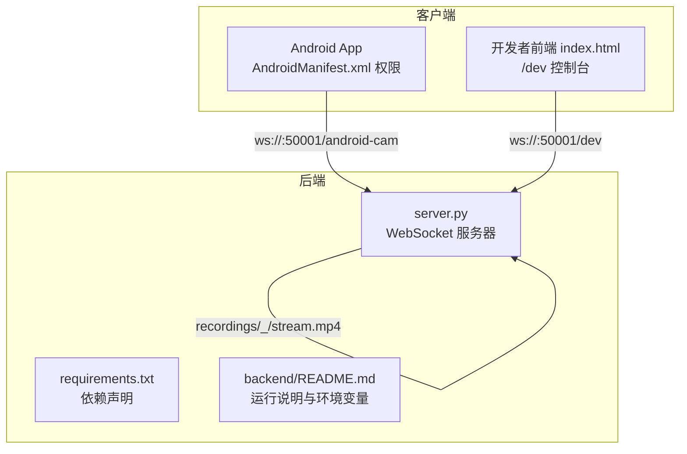
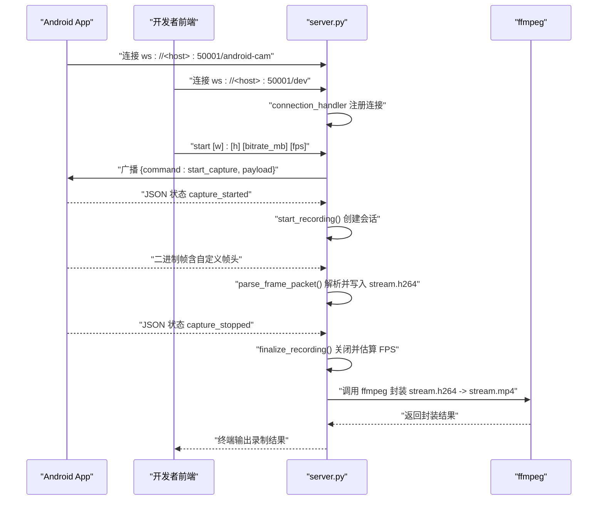
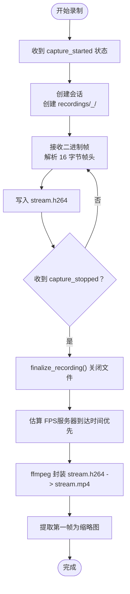
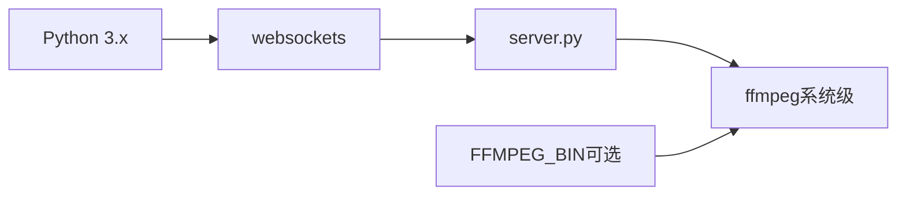

# 部署指南

<cite>
**本文引用的文件**
- [backend/README.md](file://backend/README.md)
- [backend/requirements.txt](file://backend/requirements.txt)
- [backend/server.py](file://backend/server.py)
- [developer-frontend/index.html](file://developer-frontend/index.html)
- [android-camera/app/src/main/AndroidManifest.xml](file://android-camera/app/src/main/AndroidManifest.xml)
- [archive/20251117_arduino_send_images_to_backend_and_frontend/CONFIG.md](file://archive/20251117_arduino_send_images_to_backend_and_frontend/CONFIG.md)
</cite>

## 目录
1. [简介](#简介)
2. [项目结构](#项目结构)
3. [核心组件](#核心组件)
4. [架构总览](#架构总览)
5. [详细组件分析](#详细组件分析)
6. [依赖关系分析](#依赖关系分析)
7. [性能考虑](#性能考虑)
8. [故障排查指南](#故障排查指南)
9. [结论](#结论)
10. [附录](#附录)

## 简介
本指南面向首次部署与运维该项目的用户，涵盖环境准备、依赖安装、服务启动、客户端连接、命令控制、录制产物与常见问题排查。项目后端为一个基于 Python 的 WebSocket 服务器，负责接收 Android 相机 App 推送的 H.264 帧，按会话落盘并最终封装为 MP4 文件；同时支持通过终端命令广播控制指令，驱动客户端开始/停止录制。

## 项目结构
- backend：后端服务器与依赖
  - server.py：WebSocket 服务器、帧解析、会话管理、MP4 封装与缩略图提取
  - requirements.txt：Python 依赖（仅 websockets）
  - README.md：功能说明、运行步骤、环境变量等
- developer-frontend：开发者前端控制台（用于演示与测试）
- android-camera：Android 相机 App（权限与网络配置）
- archive：历史版本示例（可作为参考）

图表来源
- [backend/server.py](file://backend/server.py#L425-L439)
- [backend/requirements.txt](file://backend/requirements.txt#L1-L3)
- [backend/README.md](file://backend/README.md#L1-L291)
- [developer-frontend/index.html](file://developer-frontend/index.html#L297-L318)
- [android-camera/app/src/main/AndroidManifest.xml](file://android-camera/app/src/main/AndroidManifest.xml#L1-L32)

章节来源
- [backend/README.md](file://backend/README.md#L1-L291)
- [backend/requirements.txt](file://backend/requirements.txt#L1-L3)
- [backend/server.py](file://backend/server.py#L425-L439)
- [developer-frontend/index.html](file://developer-frontend/index.html#L297-L318)
- [android-camera/app/src/main/AndroidManifest.xml](file://android-camera/app/src/main/AndroidManifest.xml#L1-L32)

## 核心组件
- WebSocket 服务器
  - 监听地址与端口：0.0.0.0:50001
  - 连接入口与消费者处理：connection_handler、consumer_handler
  - 会话管理：RecordingSession（按客户端与时间戳创建独立目录，写入裸 H.264）
  - 控制命令：终端输入 start/stop，广播至所有已连接客户端
- 帧解析与封装
  - 自定义帧头格式（16 字节）：设备时间戳、帧序号、负载长度
  - MP4 封装：使用 ffmpeg，显式指定帧率，避免时间轴错误
  - 缩略图提取：从 H.264 第一帧抽取 JPEG
- 环境与依赖
  - Python 3.x
  - Python 依赖：websockets
  - 系统级工具：ffmpeg（可通过环境变量 FFMPEG_BIN 指定路径）

章节来源
- [backend/server.py](file://backend/server.py#L1-L200)
- [backend/server.py](file://backend/server.py#L200-L440)
- [backend/README.md](file://backend/README.md#L1-L291)

## 架构总览
后端 server.py 作为 WebSocket 服务器，接收两类客户端：
- Android 相机 App：推送二进制 H.264 帧与 JSON 状态
- 开发者前端：通过 /dev 控制台连接，发送 start/stop/status 等命令

图表来源
- [backend/server.py](file://backend/server.py#L233-L303)
- [backend/server.py](file://backend/server.py#L305-L324)
- [backend/server.py](file://backend/server.py#L326-L423)
- [backend/server.py](file://backend/server.py#L150-L179)
- [backend/server.py](file://backend/server.py#L425-L439)
- [developer-frontend/index.html](file://developer-frontend/index.html#L356-L393)

## 详细组件分析

### 1. 环境与依赖
- Python 版本：3.x
- Python 依赖：websockets（仅）
- 系统工具：ffmpeg（命令行可用）
- 可选环境变量：FFMPEG_BIN（指定 ffmpeg 可执行文件路径）

章节来源
- [backend/README.md](file://backend/README.md#L278-L291)
- [backend/requirements.txt](file://backend/requirements.txt#L1-L3)

### 2. 启动步骤
- 安装依赖
  - 在 backend/ 目录执行 pip 安装 requirements.txt
  - 确保系统已安装 ffmpeg，并可在命令行直接调用
- 启动服务器
  - 在 backend/ 目录执行 python server.py
  - 启动后监听 ws://0.0.0.0:50001
- 连接客户端
  - Android App：在 App 中将 URL 设置为 ws://<server_host>:50001/android-cam
  - 开发者前端：访问 index.html，默认连接 ws://<host>:50001/dev
- 开始/停止录制
  - 在服务器终端输入 start/stop 命令，服务器会广播到所有已连接客户端
- 查看录制结果
  - 在 backend/recordings/ 下查找以 <ip>_<port>_YYYYMMDD_HHMMSS 命名的目录，包含 stream.mp4 与缩略图

章节来源
- [backend/README.md](file://backend/README.md#L217-L275)
- [backend/server.py](file://backend/server.py#L425-L439)
- [developer-frontend/index.html](file://developer-frontend/index.html#L297-L318)
- [android-camera/app/src/main/AndroidManifest.xml](file://android-camera/app/src/main/AndroidManifest.xml#L1-L32)

### 3. 服务器地址与端口配置
- 固定监听地址与端口：0.0.0.0:50001
- Android 客户端连接路径：/android-cam
- 开发者前端连接路径：/dev
- 如需在不同主机或端口运行，请修改 server.py 中的监听配置并同步调整客户端连接地址

章节来源
- [backend/server.py](file://backend/server.py#L425-L439)
- [developer-frontend/index.html](file://developer-frontend/index.html#L313-L318)

### 4. Android 客户端配置
- 权限与网络
  - 使用 CAMERA、INTERNET 权限
  - 配置网络明文传输（network_security_config.xml）以允许 HTTP WebSocket
- 连接地址
  - 在 App 中设置 WebSocket URL 为 ws://<server_host>:50001/android-cam
- 帧格式
  - 二进制帧包含 16 字节自定义帧头（设备时间戳、帧序号、负载长度），随后为 H.264 裸码流

章节来源
- [android-camera/app/src/main/AndroidManifest.xml](file://android-camera/app/src/main/AndroidManifest.xml#L1-L32)
- [backend/README.md](file://backend/README.md#L1-L23)

### 5. 开发者前端配置
- 连接地址
  - 默认连接 ws://<host>:50001/dev
  - 可在页面输入框中修改为其他主机/端口
- 功能
  - 连接/断开
  - 发送 start/stop/status 等命令
  - 接收二进制图片数据并在画布中预览

章节来源
- [developer-frontend/index.html](file://developer-frontend/index.html#L297-L318)
- [developer-frontend/index.html](file://developer-frontend/index.html#L356-L393)

### 6. 命令控制与广播
- 终端命令
  - start [w]:[h] [bitrate_mb] [fps]
    - w:h：可选宽高比（如 4:3、16:9）
    - bitrate_mb：可选码率（MB/s，默认 4）
    - fps：可选目标帧率（默认 10；负数修正为 10；0 表示不限帧率）
  - stop：广播停止录制命令
- 广播机制
  - 服务器将命令广播给所有已连接客户端

章节来源
- [backend/README.md](file://backend/README.md#L160-L215)
- [backend/server.py](file://backend/server.py#L326-L423)
- [backend/server.py](file://backend/server.py#L305-L324)

### 7. 录制流程与封装
- 会话创建
  - 当收到 capture_started 状态时，创建 RecordingSession，生成 recordings/<client>_<timestamp>/ 目录
- 帧写入
  - 解析 16 字节帧头，将 H.264 裸码流写入 stream.h264
- 结束与封装
  - finalize_recording() 关闭文件并估算 FPS（优先服务器到达时间，其次设备时间戳）
  - 调用 ffmpeg 将 stream.h264 封装为 stream.mp4（-c:v copy，不重编码）
  - 提取第一帧为缩略图 thumbnail.jpg

图表来源
- [backend/server.py](file://backend/server.py#L210-L231)
- [backend/server.py](file://backend/server.py#L64-L133)
- [backend/server.py](file://backend/server.py#L150-L179)
- [backend/server.py](file://backend/server.py#L181-L207)

章节来源
- [backend/server.py](file://backend/server.py#L210-L231)
- [backend/server.py](file://backend/server.py#L64-L133)
- [backend/server.py](file://backend/server.py#L150-L207)

### 8. 环境变量与 ffmpeg 路径
- FFMPEG_BIN
  - 作用：指定 ffmpeg 可执行文件的绝对路径
  - 使用场景：系统未安装 ffmpeg 或希望使用特定版本
- 默认行为
  - 若未设置，服务器将直接调用 ffmpeg 命令

章节来源
- [backend/README.md](file://backend/README.md#L284-L291)
- [backend/server.py](file://backend/server.py#L162-L169)

### 9. 历史示例参考（可选）
- Arduino 客户端示例
  - 配置服务器地址与端口（WEBSOCKET_SERVER、WEBSOCKET_PORT）
  - 服务器支持 /esp 与 /dev 两个 endpoint
- 说明
  - 本仓库当前后端为 Android 相机专用；如需 Arduino 客户端，请参考 archive 目录中的示例

章节来源
- [archive/20251117_arduino_send_images_to_backend_and_frontend/CONFIG.md](file://archive/20251117_arduino_send_images_to_backend_and_frontend/CONFIG.md#L1-L22)

## 依赖关系分析
- Python 依赖
  - websockets：提供 WebSocket 服务器与客户端能力
- 系统依赖
  - ffmpeg：用于将裸 H.264 封装为 MP4
- 环境变量
  - FFMPEG_BIN：覆盖 ffmpeg 可执行文件路径

图表来源
- [backend/requirements.txt](file://backend/requirements.txt#L1-L3)
- [backend/server.py](file://backend/server.py#L162-L169)
- [backend/README.md](file://backend/README.md#L278-L291)

章节来源
- [backend/requirements.txt](file://backend/requirements.txt#L1-L3)
- [backend/server.py](file://backend/server.py#L162-L169)
- [backend/README.md](file://backend/README.md#L278-L291)

## 性能考虑
- 封装策略
  - 使用 -c:v copy 直接拷贝视频轨，避免重编码，提升吞吐与降低 CPU 占用
- 帧率估算
  - 优先使用服务器到达时间估算 FPS，若不可信则回退到设备时间戳
- 网络与硬件
  - Android App 端已完成旋转，后端无需再次旋转，减少额外处理
- 存储
  - 录制文件按会话独立目录存放，便于管理与清理

章节来源
- [backend/server.py](file://backend/server.py#L150-L179)
- [backend/server.py](file://backend/server.py#L80-L133)

## 故障排查指南
- 无法连接 Android App
  - 检查服务器监听地址与端口是否可达（0.0.0.0:50001）
  - 确认 App 中的 URL 为 ws://<server_host>:50001/android-cam
  - 检查防火墙与网络策略
- 无法连接开发者前端
  - 确认浏览器可访问 ws://<host>:50001/dev
  - 检查浏览器控制台是否有 WebSocket 错误
- ffmpeg 无法找到或封装失败
  - 确认系统已安装 ffmpeg，并可在命令行直接调用
  - 如需自定义路径，设置环境变量 FFMPEG_BIN
  - 查看服务器终端输出的 stderr 信息
- 录制完成后无 MP4
  - 检查 recordings/<client>_<timestamp>/ 目录是否存在 stream.h264
  - 确认 ffmpeg 返回码为 0
- 帧率异常
  - 服务器会根据设备时间戳与服务器到达时间估算 FPS，若估算不可信，将回退到保底值
- 终端命令无效
  - 确保在服务器终端输入 start/stop
  - start 命令参数格式：start [w]:[h] [bitrate_mb] [fps]

章节来源
- [backend/server.py](file://backend/server.py#L150-L179)
- [backend/server.py](file://backend/server.py#L181-L207)
- [backend/server.py](file://backend/server.py#L326-L423)
- [backend/README.md](file://backend/README.md#L217-L275)

## 结论
本部署指南提供了从环境准备、依赖安装、服务启动到客户端连接与录制产物查看的完整流程，并对常见问题进行了排查建议。按照步骤操作即可快速搭建并稳定运行后端服务器，满足 Android 相机 App 的实时推流与录制需求。

## 附录
- 快速检查清单
  - 已安装 Python 3.x
  - 已安装 ffmpeg
  - 已在 backend/ 目录执行 pip install -r requirements.txt
  - 已在 backend/ 目录执行 python server.py
  - Android App URL 设置为 ws://<server_host>:50001/android-cam
  - 开发者前端 URL 设置为 ws://<host>:50001/dev
  - 终端输入 start/stop 控制录制
  - 查看 backend/recordings/ 下的 MP4 与缩略图