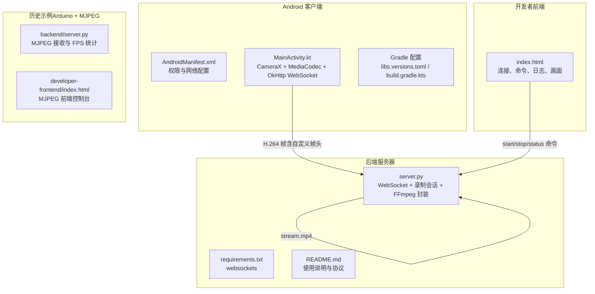
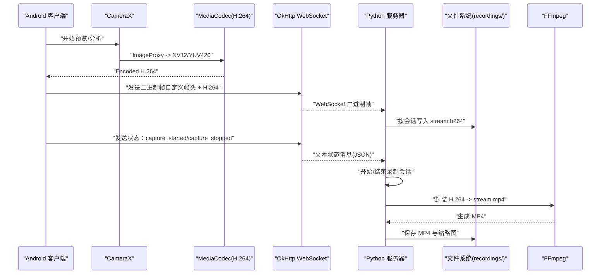
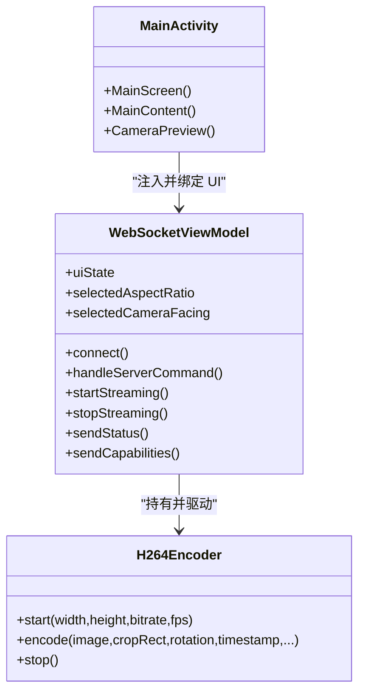
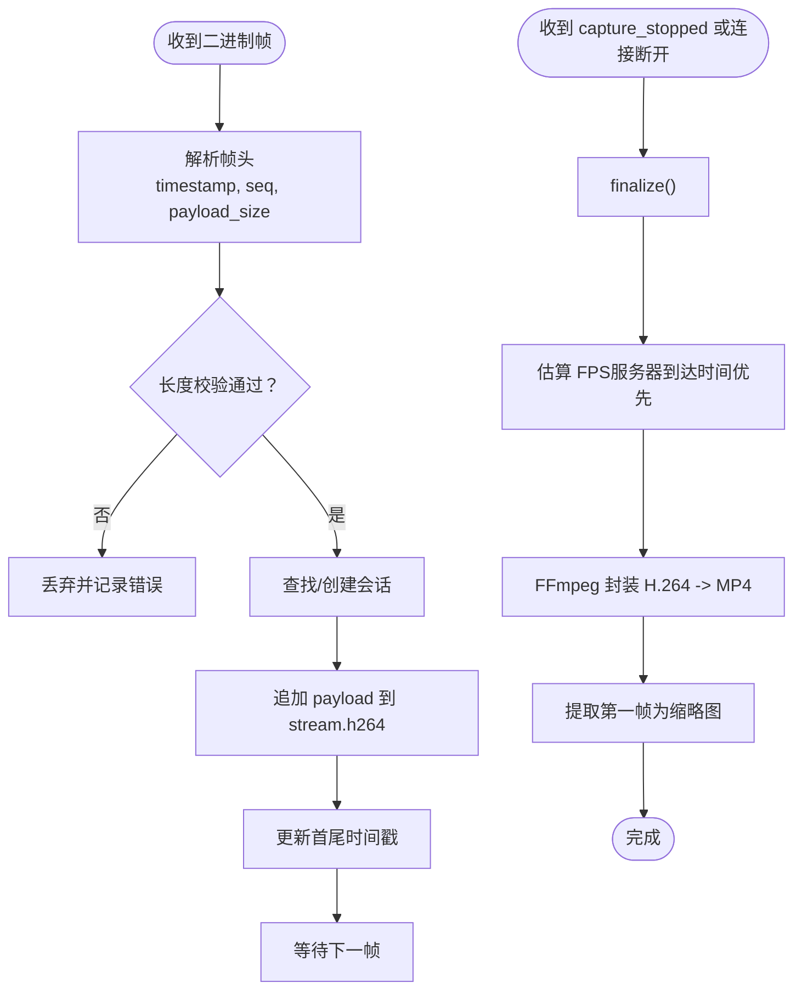
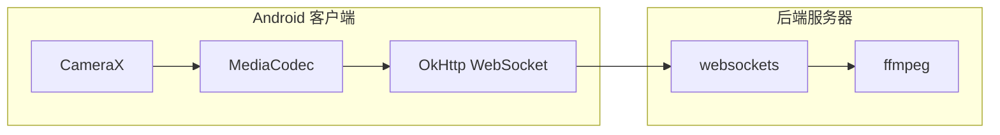

# 项目概述

<cite>
**本文引用的文件**
- [android-camera/app/src/main/AndroidManifest.xml](file://android-camera/app/src/main/AndroidManifest.xml)
- [android-camera/app/src/main/java/com/example/lablogcamera/MainActivity.kt](file://android-camera/app/src/main/java/com/example/lablogcamera/MainActivity.kt)
- [android-camera/app/build.gradle.kts](file://android-camera/app/build.gradle.kts)
- [android-camera/gradle/libs.versions.toml](file://android-camera/gradle/libs.versions.toml)
- [backend/server.py](file://backend/server.py)
- [backend/README.md](file://backend/README.md)
- [backend/requirements.txt](file://backend/requirements.txt)
- [developer-frontend/index.html](file://developer-frontend/index.html)
- [archive/20251117_arduino_send_images_to_backend_and_frontend/backend/server.py](file://archive/20251117_arduino_send_images_to_backend_and_frontend/backend/server.py)
- [archive/20251117_arduino_send_images_to_backend_and_frontend/developer-frontend/index.html](file://archive/20251117_arduino_send_images_to_backend_and_frontend/developer-frontend/index.html)
</cite>

## 目录
1. [引言](#引言)
2. [项目结构](#项目结构)
3. [核心组件](#核心组件)
4. [架构总览](#架构总览)
5. [详细组件分析](#详细组件分析)
6. [依赖关系分析](#依赖关系分析)
7. [性能考量](#性能考量)
8. [故障排查指南](#故障排查指南)
9. [结论](#结论)
10. [附录](#附录)

## 引言
lab-log 是一个全栈视频采集与录制系统，核心目标是将 Android 摄像头采集的 H.264 视频流通过 WebSocket 实时传输至后端服务器，由服务器按会话写入裸 H.264 码流并在录制结束后封装为 MP4 文件。项目同时提供开发者前端页面，用于连接后端、发送控制命令、查看日志与实时画面（在另一套历史实现中）。

- Android 客户端：使用 CameraX 进行图像采集，MediaCodec 进行 H.264 编码，OkHttp WebSocket 发送自定义帧头 + H.264 裸码流。
- 后端服务器：使用 Python websockets，接收二进制帧，按客户端会话写入 recordings/ 目录，结束时调用 ffmpeg 将 H.264 封装为 MP4。
- 开发者前端：提供连接、命令控制、日志与画面展示（在另一套历史实现中）。

本项目既适合初学者理解“摄像头 → H.264 编码 → WebSocket → 服务器录制 → MP4 封装”的完整链路，也为有经验的开发者提供了可扩展的架构与实现细节。

## 项目结构
项目采用模块化组织，包含 Android 客户端、Python 后端、开发者前端，以及历史版本的 Arduino+MJPEG 示例。

图表来源
- [android-camera/app/src/main/AndroidManifest.xml](file://android-camera/app/src/main/AndroidManifest.xml#L1-L32)
- [android-camera/app/src/main/java/com/example/lablogcamera/MainActivity.kt](file://android-camera/app/src/main/java/com/example/lablogcamera/MainActivity.kt#L1-L200)
- [backend/server.py](file://backend/server.py#L1-L120)
- [developer-frontend/index.html](file://developer-frontend/index.html#L1-L120)
- [archive/20251117_arduino_send_images_to_backend_and_frontend/backend/server.py](file://archive/20251117_arduino_send_images_to_backend_and_frontend/backend/server.py#L1-L120)

章节来源
- [android-camera/app/src/main/AndroidManifest.xml](file://android-camera/app/src/main/AndroidManifest.xml#L1-L32)
- [android-camera/app/build.gradle.kts](file://android-camera/app/build.gradle.kts#L1-L68)
- [android-camera/gradle/libs.versions.toml](file://android-camera/gradle/libs.versions.toml#L1-L33)
- [backend/server.py](file://backend/server.py#L1-L120)
- [backend/README.md](file://backend/README.md#L1-L120)
- [backend/requirements.txt](file://backend/requirements.txt#L1-L3)
- [developer-frontend/index.html](file://developer-frontend/index.html#L1-L120)

## 核心组件
- Android 客户端（Kotlin/Compose）
  - CameraX 图像采集与预览
  - MediaCodec H.264 编码器封装
  - OkHttp WebSocket 发送自定义帧头 + H.264 裸码流
  - 服务器命令解析与状态上报
- 后端服务器（Python）
  - WebSocket 服务端，接收二进制帧与文本状态
  - 录制会话管理，按客户端会话写入 recordings/
  - FFmpeg 封装裸 H.264 为 MP4，提取缩略图
- 开发者前端（JavaScript/HTML）
  - 连接后端，发送 start/stop/status 命令
  - 展示日志与实时画面（在另一套历史实现中）

章节来源
- [android-camera/app/src/main/java/com/example/lablogcamera/MainActivity.kt](file://android-camera/app/src/main/java/com/example/lablogcamera/MainActivity.kt#L1-L200)
- [backend/server.py](file://backend/server.py#L1-L120)
- [developer-frontend/index.html](file://developer-frontend/index.html#L1-L120)

## 架构总览
整体数据流：Android 摄像头采集 → CameraX → MediaCodec H.264 编码 → 自定义帧头 + H.264 → OkHttp WebSocket → Python 服务器 → 录制会话 → FFmpeg 封装 → MP4

图表来源
- [android-camera/app/src/main/java/com/example/lablogcamera/MainActivity.kt](file://android-camera/app/src/main/java/com/example/lablogcamera/MainActivity.kt#L944-L1200)
- [backend/server.py](file://backend/server.py#L233-L324)

## 详细组件分析

### Android 客户端（Kotlin/Compose）
- 权限与网络
  - Manifest 声明相机与网络权限，启用网络安全配置
- ViewModel 与 UI
  - WebSocketViewModel 负责 WebSocket 生命周期、命令解析、编码器控制、UI 状态
  - Compose UI 提供摄像头选择、宽高比选择、连接开关、状态显示
- CameraX 与预览
  - 使用 UseCaseGroup 统一 Preview 与 ImageAnalysis 的 FOV 与旋转
  - 通过 ViewPort 与 AspectRatio 控制预览填充策略
- 编码与帧头
  - H264Encoder 封装 MediaCodec，将 YUV_420_888 转换为 NV12，送入编码器
  - 自定义帧头：设备时间戳（毫秒）、帧序号（低32位）、负载长度（H.264 字节）
  - 发送策略：按服务器下发的目标 FPS 主动丢帧，控制发送速率
- 服务器命令与状态
  - 解析 start_capture/stop_capture 命令，启动/停止编码与发送
  - 上报 capture_started/capture_stopped 状态，配合后端会话管理

图表来源
- [android-camera/app/src/main/java/com/example/lablogcamera/MainActivity.kt](file://android-camera/app/src/main/java/com/example/lablogcamera/MainActivity.kt#L553-L1200)

章节来源
- [android-camera/app/src/main/AndroidManifest.xml](file://android-camera/app/src/main/AndroidManifest.xml#L1-L32)
- [android-camera/app/src/main/java/com/example/lablogcamera/MainActivity.kt](file://android-camera/app/src/main/java/com/example/lablogcamera/MainActivity.kt#L553-L1200)
- [android-camera/app/build.gradle.kts](file://android-camera/app/build.gradle.kts#L1-L68)
- [android-camera/gradle/libs.versions.toml](file://android-camera/gradle/libs.versions.toml#L1-L33)

### 后端服务器（Python）
- WebSocket 服务
  - websockets.serve 监听 0.0.0.0:50001
  - connection_handler 记录客户端并委托 consumer_handler
- 消息处理
  - 文本消息：JSON 状态（capture_started/capture_stopped）
  - 二进制消息：自定义帧头 + H.264 裸码流
  - parse_frame_packet 校验帧头长度与负载长度
- 录制会话
  - RecordingSession 按客户端 IP+端口创建独立目录
  - 追加写入 stream.h264，记录首尾设备时间戳与服务器到达时间
  - finalize 时估算 FPS，调用 FFmpeg 封装为 MP4，提取缩略图
- 终端控制
  - terminal_input_handler 支持 start [w]:[h] [bitrate_mb] [fps] 与 stop
  - broadcast 广播命令给所有已连接客户端

图表来源
- [backend/server.py](file://backend/server.py#L135-L208)
- [backend/server.py](file://backend/server.py#L210-L324)
- [backend/server.py](file://backend/server.py#L326-L440)

章节来源
- [backend/server.py](file://backend/server.py#L1-L440)
- [backend/README.md](file://backend/README.md#L1-L291)
- [backend/requirements.txt](file://backend/requirements.txt#L1-L3)

### 开发者前端（JavaScript/HTML）
- 连接与状态
  - 默认 URL 指向后端 /dev 端点，支持连接/断开
  - 状态栏显示连接状态
- 命令控制
  - start/stop/status 命令通过 WebSocket 发送到后端
  - start 可携带分辨率与质量参数（在另一套历史实现中）
- 日志与画面
  - 文本消息显示日志
  - 二进制消息作为图片显示（在另一套历史实现中）

章节来源
- [developer-frontend/index.html](file://developer-frontend/index.html#L1-L200)

### 历史示例（Arduino + MJPEG）
该项目还包含一套 Arduino + MJPEG 的历史实现，用于对比与参考：
- 后端 server.py 接收 ESP32 发送的 JPEG 图片，统计 FPS，转发给前端
- 前端 developer-frontend/index.html 展示图片与日志
- 与当前 Android + H.264 的实现相比，MJPEG 版本更简单，但不涉及 H.264 编码与 FFmpeg 封装

章节来源
- [archive/20251117_arduino_send_images_to_backend_and_frontend/backend/server.py](file://archive/20251117_arduino_send_images_to_backend_and_frontend/backend/server.py#L1-L200)
- [archive/20251117_arduino_send_images_to_backend_and_frontend/developer-frontend/index.html](file://archive/20251117_arduino_send_images_to_backend_and_frontend/developer-frontend/index.html#L1-L200)

## 依赖关系分析
- Android 客户端
  - CameraX：camera-core/camera-camera2/camera-lifecycle/camera-view
  - MediaCodec：系统 API，用于 H.264 编码
  - OkHttp：WebSocket 客户端
  - Compose：UI 框架
- 后端服务器
  - websockets：异步 WebSocket 服务端
  - ffmpeg：系统工具，用于 H.264 封装
- 开发者前端
  - HTML/CSS/JS：WebSocket 连接、命令发送、日志与画面展示

图表来源
- [android-camera/app/build.gradle.kts](file://android-camera/app/build.gradle.kts#L44-L68)
- [backend/requirements.txt](file://backend/requirements.txt#L1-L3)

章节来源
- [android-camera/app/build.gradle.kts](file://android-camera/app/build.gradle.kts#L1-L68)
- [backend/requirements.txt](file://backend/requirements.txt#L1-L3)

## 性能考量
- 编码与发送
  - 服务器下发目标 FPS，客户端按时间间隔主动丢帧，避免网络拥塞与编码器过载
  - 编码器初始化使用设备支持的最大分辨率，提高 FOV；按目标宽高比裁剪并 32 对齐，减少硬件编码器兼容性问题
- 传输与录制
  - 自定义帧头包含设备时间戳，后端可基于服务器到达时间估算更准确的 FPS，避免 FFmpeg 误判
  - 录制结束后调用 FFmpeg -c:v copy 直接拷贝视频轨，无重编码，速度快且无损
- UI 与资源
  - 采集中保持屏幕常亮，避免锁屏中断采集
  - 预览使用 FIT_CENTER，避免裁剪带来的画面失真

章节来源
- [android-camera/app/src/main/java/com/example/lablogcamera/MainActivity.kt](file://android-camera/app/src/main/java/com/example/lablogcamera/MainActivity.kt#L1188-L1225)
- [backend/server.py](file://backend/server.py#L150-L208)
- [backend/server.py](file://backend/server.py#L210-L280)

## 故障排查指南
- 连接问题
  - 确认 Android Manifest 权限（相机、网络）已授予
  - 检查 WebSocket URL 与端口（默认 ws://...:50001）
  - 查看后端日志，确认连接建立与命令广播
- 编码与帧率
  - 若帧率过高导致卡顿，可在服务器端降低目标 FPS
  - 检查客户端是否正确应用裁剪与对齐，避免硬件编码器报错
- FFmpeg 封装失败
  - 确认系统已安装 ffmpeg，或设置环境变量 FFMPEG_BIN 指向可执行文件
  - 检查 recordings/ 目录权限与磁盘空间
- 前端画面
  - 历史实现中，前端 /dev 用于命令控制与日志；若需查看实时画面，请使用对应的前端页面

章节来源
- [android-camera/app/src/main/AndroidManifest.xml](file://android-camera/app/src/main/AndroidManifest.xml#L1-L32)
- [backend/README.md](file://backend/README.md#L217-L291)
- [backend/server.py](file://backend/server.py#L150-L208)

## 结论
lab-log 提供了一个清晰、可扩展的全栈视频采集与录制方案：Android 客户端负责高质量 H.264 编码与稳定传输，后端服务器专注于会话管理与无损封装，开发者前端提供便捷的控制与可视化。该架构既满足教学演示，也具备工程落地的可行性。对于需要更复杂控制或不同媒体格式的场景，可在此基础上扩展命令协议与处理逻辑。

## 附录
- 快速启动（后端）
  - 安装依赖：pip install -r backend/requirements.txt
  - 安装 ffmpeg：sudo apt install ffmpeg
  - 启动服务器：python backend/server.py
  - 在终端输入 start/stop 控制录制
- 快速使用（Android 客户端）
  - 在 App 中设置 WebSocket URL 为 ws://<server_host>:50001/android-cam
  - 授权相机权限后，点击连接并开始录制
  - 在后端终端输入 start [w]:[h] [bitrate_mb] [fps] 下发参数
- 关键文件定位
  - Android 客户端：android-camera/app/src/main/java/com/example/lablogcamera/MainActivity.kt
  - 后端服务器：backend/server.py
  - 开发者前端：developer-frontend/index.html
  - 历史示例（Arduino + MJPEG）：archive/20251117_arduino_send_images_to_backend_and_frontend/*